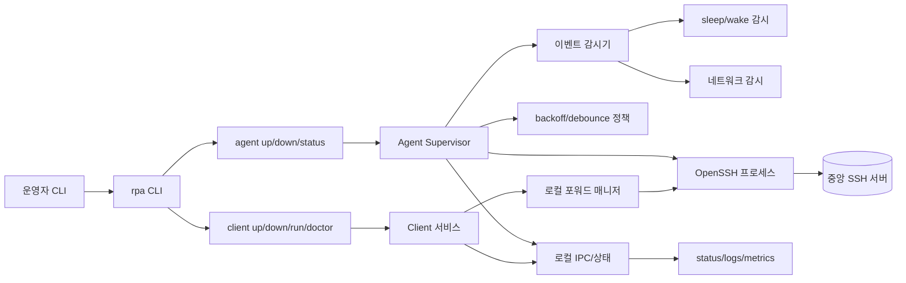
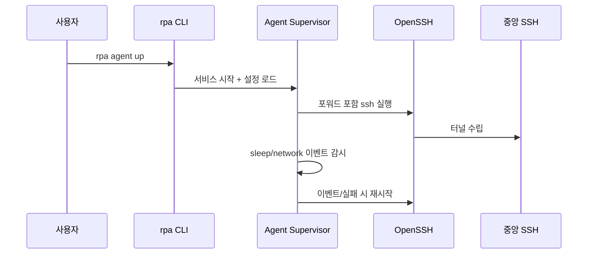

# reverse-proxy-agent (rpa)

"내 홈서버를 외부에 노출하고 싶은데, 불특정 다수의 접속은 허용하지 않으면서
선별된 사용자에게만 SSH 기반 접근을 허용하고 싶다" 라는 목적을 위한
reverse proxy / ssh tunnel agent입니다.

## Why not `ngrok` / `tailscale`?

- ngrok, tailscale 역시 훌륭한 솔루션이지만, 홈서버 운영 환경에서 '불특정 다수에게 노출하지 않고'
  '특정 사용자에게만 접근을 허용'하는 설정을 아주 가볍게 하기는 쉽지 않습니다.
- 특히 tailscale은 Funnel/공유 기능의 사용성과 편의성이 높지만, 설정/권한 구조가 rpa가 지향하는
  "SSH 기반으로 최소 권한만 주는 접근"과는 조금 다릅니다. 이 README의 예시들도 그런 Funnel 방식의
  사용자 경험과 비교되는 포인트를 염두에 두고 작성되었습니다.
- tailscale을 여러 사용자가 안정적으로 쓰려면 유료 플랜이 필요한 경우가 많습니다. 반면 rpa는
  SSH 인스턴스 하나만 있으면, 그 인스턴스에 접근 가능한 사용자라면 인원수 제한 없이 확장할 수 있습니다.
- 이 프로젝트는 SSH 기반으로 좁은 범위(선별된 사용자)의 접근만 허용하는 용도로 설계되었습니다.

## Use cases

- 홈서버 개발 테스트 환경에서 외부 접속을 열고 싶을 때
- 개인 서버를 특정 인원에게만 공개하고 싶을 때
- SSH 터널을 항상 살아있도록 관리하고 싶은 경우

## 설치

### GitHub Releases (권장)
```sh
curl -L -o rpa https://github.com/<owner>/<repo>/releases/latest/download/rpa_<version>_darwin_arm64
chmod +x rpa
mv rpa /usr/local/bin/
```

### 소스에서 빌드
```sh
cd apps/rpa
go build -o rpa ./cmd/rpa
```

## 빠른 시작

### Agent (원격 포워드)
```sh
rpa init \
  --ssh-user ubuntu \
  --ssh-host example.com \
  --remote-forward "0.0.0.0:2222:localhost:22"

rpa agent up
rpa status
rpa logs --follow
```

### Client (로컬 포워드)
```sh
rpa init \
  --ssh-user ubuntu \
  --ssh-host example.com \
  --local-forward "127.0.0.1:15432:127.0.0.1:5432"

rpa client up
rpa status
rpa logs --follow
```

## 구성 예시

```yaml
agent:
  name: "rpa-agent"
  launchd_label: "com.rpa.agent"
  restart_policy: "always"
  prevent_sleep: false
  restart:
    min_delay_ms: 2000
    max_delay_ms: 30000
    factor: 2.0
    jitter: 0.2
    debounce_ms: 2000
  periodic_restart_sec: 3600
  sleep_check_sec: 5
  sleep_gap_sec: 30
  network_poll_sec: 5

client:
  name: "rpa-client"
  launchd_label: "com.rpa.client"
  restart_policy: "always"
  prevent_sleep: false
  restart:
    min_delay_ms: 2000
    max_delay_ms: 30000
    factor: 2.0
    jitter: 0.2
    debounce_ms: 2000
  periodic_restart_sec: 3600
  sleep_check_sec: 5
  sleep_gap_sec: 30
  network_poll_sec: 5
  local_forwards:
    - "127.0.0.1:15432:127.0.0.1:5432"
    - "127.0.0.1:16379:127.0.0.1:6379"

ssh:
  user: "ubuntu"
  host: "example.com"
  port: 22
  check_sec: 5
  remote_forwards:
    - "0.0.0.0:2222:localhost:22"
    - "0.0.0.0:2223:localhost:23"
  identity_file: "~/.ssh/id_ed25519"
  options:
    - "ServerAliveInterval=30"
    - "ServerAliveCountMax=3"

logging:
  level: "info"
  path: "~/.rpa/logs/agent.log"

client_logging:
  level: "info"
  path: "~/.rpa/logs/client.log"
```

메모:
- `ssh.remote_forwards`는 중복 제거됩니다.
- 기본 SSH 옵션에 `ServerAlive*`와 `StrictHostKeyChecking=accept-new`가 포함됩니다(이미 지정한 경우 유지).
- `ssh.check_sec`은 SSH 호스트 TCP 체크 주기이며 `rpa status`에 표시됩니다.
- `agent clear`는 포워드를 모두 제거하고 서비스도 내려갑니다.

## 관측성

- 로그는 JSON 라인 형식
- `last_success_unix`는 연결이 2초 이상 유지된 뒤에만 기록됨
- status/metrics 상세 스키마: `docs/OBSERVABILITY.md`
- 구현/복구 로직 상세 설명: `docs/ARCHITECTURE.md`

## 릴리스 (GitHub Releases)

`v*` 태그를 푸시하면 GoReleaser가 바이너리를 업로드합니다.
```sh
git tag v0.1.0
git push origin v0.1.0
```

## 개발

```sh
cd apps/rpa
go test ./...
```

개발 진행 과정은 `docs/archive` 문서들을 통해 확인할 수 있습니다.

## Android 앱

Android 앱은 `apps/rpa-android`에 있습니다. 모바일에서 rpa client를 더 자연스럽고 안정적으로 쓰기 위해
Go 바이너리 대신 Android 네이티브 기술스택으로 구현한 전용 클라이언트입니다. 폰에서 SSH 터널을 유지하고
상태/로그/설정을 관리할 수 있게 하여, 데스크톱에서 하던 rpa client 작업을 모바일에서도 동일하게 수행할 수 있도록
설계되었습니다.

### 기술 스택
- Kotlin: 앱 전체 로직 구현
- Coroutines/Flow: 터널 상태, 로그 스트림, 백그라운드 작업 처리
- Jetpack Compose: 상태/로그/설정/메트릭/닥터 화면 UI
- Material 3: UI 컴포넌트와 테마
- Foreground Service: 터널을 백그라운드에서 유지하고 상태바 알림 제공
- SSHJ: SSH 연결 및 로컬 포워딩
- SnakeYAML: rpa.yaml 파싱/검증

## 내부 컴포넌트 구조 (Mermaid)




