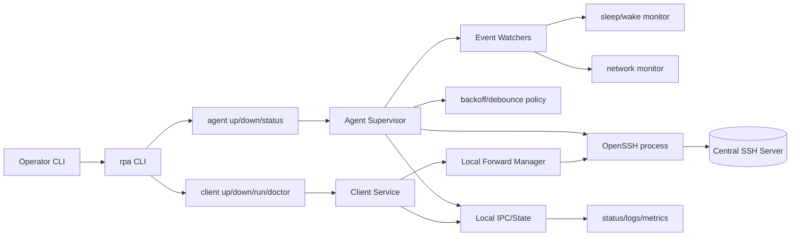
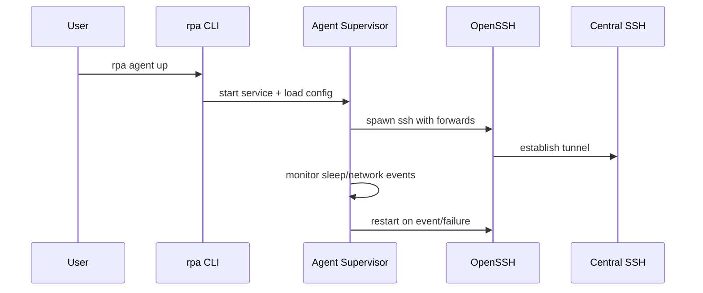

# reverse-proxy-agent (rpa)

`reverse-proxy-agent` is an SSH tunnel manager for this goal:

"I want to expose my home server externally, but not to the public internet. I only want SSH-based access for selected users."

Korean version: `README.ko.md`

## Why not `ngrok` / `tailscale`?

- `ngrok` and `tailscale` are both great tools, but it is not always simple to keep access tightly limited to specific users in small home-server setups.
- In particular, Tailscale Funnel/share workflows are very convenient, but they are different from rpa's model: SSH-centric access with minimal privileges.
- Tailscale can also require paid plans for stable multi-user operation in some scenarios. rpa can scale as long as users can access a single SSH instance.
- This project is intentionally designed for narrow, selected-user access based on standard SSH.

## Use Cases

- Opening external access for home-server development/test environments
- Sharing a private server with a small set of people
- Keeping SSH tunnels alive continuously with automatic recovery

## Installation

### GitHub Releases (Recommended)
```sh
curl -L -o rpa https://github.com/<owner>/<repo>/releases/latest/download/rpa_<version>_darwin_arm64
chmod +x rpa
mv rpa /usr/local/bin/
```

### Build From Source
```sh
cd apps/rpa
go build -o rpa ./cmd/rpa
```

## Quick Start

### Agent (Remote Forward)
```sh
rpa init \
  --ssh-user ubuntu \
  --ssh-host example.com \
  --remote-forward "0.0.0.0:2222:localhost:22"

rpa agent up
rpa status
rpa logs --follow
```

### Client (Local Forward)
```sh
rpa init \
  --ssh-user ubuntu \
  --ssh-host example.com \
  --local-forward "127.0.0.1:15432:127.0.0.1:5432"

rpa client up
rpa status
rpa logs --follow
```

## Configuration Example

```yaml
agent:
  name: "rpa-agent"
  launchd_label: "com.rpa.agent"
  restart_policy: "always"
  prevent_sleep: false
  restart:
    min_delay_ms: 2000
    max_delay_ms: 30000
    factor: 2.0
    jitter: 0.2
    debounce_ms: 2000
  periodic_restart_sec: 3600
  sleep_check_sec: 5
  sleep_gap_sec: 30
  network_poll_sec: 5

client:
  name: "rpa-client"
  launchd_label: "com.rpa.client"
  restart_policy: "always"
  prevent_sleep: false
  restart:
    min_delay_ms: 2000
    max_delay_ms: 30000
    factor: 2.0
    jitter: 0.2
    debounce_ms: 2000
  periodic_restart_sec: 3600
  sleep_check_sec: 5
  sleep_gap_sec: 30
  network_poll_sec: 5
  local_forwards:
    - "127.0.0.1:15432:127.0.0.1:5432"
    - "127.0.0.1:16379:127.0.0.1:6379"

ssh:
  user: "ubuntu"
  host: "example.com"
  port: 22
  check_sec: 5
  remote_forwards:
    - "0.0.0.0:2222:localhost:22"
    - "0.0.0.0:2223:localhost:23"
  identity_file: "~/.ssh/id_ed25519"
  options:
    - "ServerAliveInterval=30"
    - "ServerAliveCountMax=3"

logging:
  level: "info"
  path: "~/.rpa/logs/agent.log"

client_logging:
  level: "info"
  path: "~/.rpa/logs/client.log"
```

Notes:
- `ssh.remote_forwards` is deduplicated.
- Default SSH options include `ServerAlive*` and `StrictHostKeyChecking=accept-new` (existing user-defined options are preserved).
- `ssh.check_sec` is the SSH host TCP check interval and appears in `rpa status`.
- `agent clear` removes all forwards and also stops the service.

## Observability

- Logs are JSON Lines.
- `last_success_unix` is recorded only after a connection has stayed alive for at least 2 seconds.
- Detailed status/metrics schema: `docs/OBSERVABILITY.md`
- Implementation and recovery details: `docs/ARCHITECTURE.md`

## Release (GitHub Releases)

Pushing a `v*` tag triggers GoReleaser and uploads binaries.

```sh
git tag v0.1.0
git push origin v0.1.0
```

## Development

```sh
cd apps/rpa
go test ./...
```

Historical development records are available in `docs/archive`.

## Android App

The Android app is under `apps/rpa-android`. It is a dedicated mobile client implemented with Android-native technologies rather than reusing the Go binary directly. It is designed to keep SSH tunnels alive on phones and manage status/logs/config, so common desktop `rpa client` operations can be performed on mobile as well.

### Tech Stack
- Kotlin: app-wide logic
- Coroutines/Flow: tunnel state, log streams, background jobs
- Jetpack Compose: status/logs/config/metrics/doctor screens
- Material 3: UI components and theming
- Foreground Service: keep tunnels running in background with notification
- SSHJ: SSH connections and local forwarding
- SnakeYAML: `rpa.yaml` parsing and validation

## Internal Component Structure (Mermaid)




