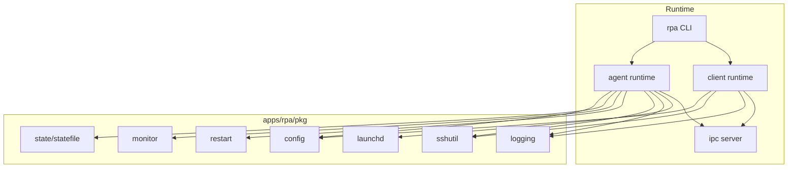
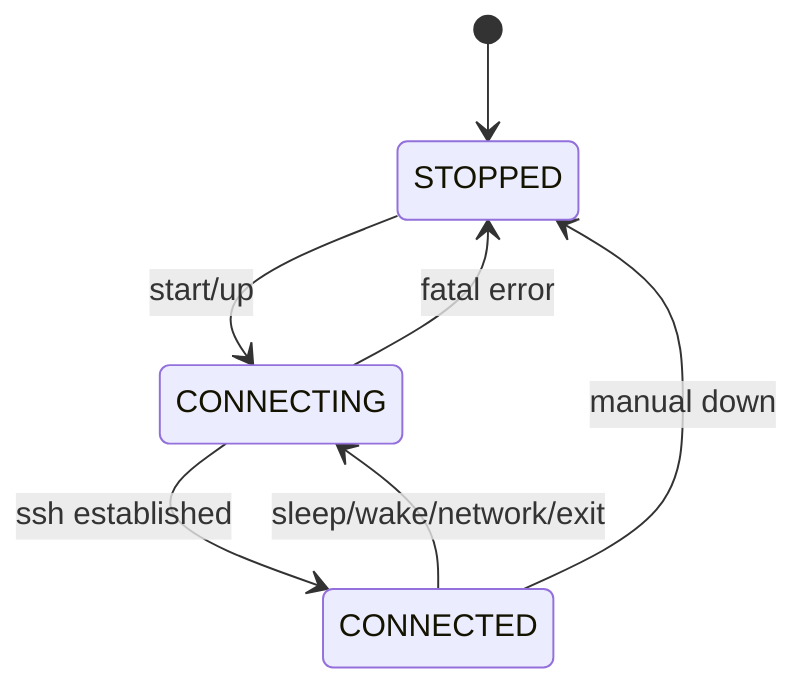

========================================================
Detailed Project Development Plan
========================================================

1. Overview

The goal of this project is to build a dedicated tool for stable operation and recovery of SSH tunnels on macOS.
The tool uses OpenSSH as-is and is designed to fully respect SSH's existing security model and reliability.
The core problem statement is: "SSH is secure enough, but long-running tunnel operations lack strong management primitives."
For that reason, this project does not introduce a new networking stack or security framework. It focuses only on reliable SSH process supervision.
The final deliverable is a macOS-focused SSH tunnel manager that can replace autossh.

In addition, this project prioritizes "operator UX (Agent admin / Client admin)" as a first-class value.
Users should be able to bring up tunnels as services with one command and keep them alive via automatic recovery until they intentionally stop them.
It also provides CLI-based status/log/metric visibility by default for easier operations and troubleshooting.

2. Background

SSH has been a proven remote access and tunneling technology for decades, and its core security model is not the problem.
However, in macOS environments, long-running SSH port forwarding often fails in operational ways.

Representative issues:
First, autossh does not integrate naturally with launchd and clashes with standard macOS service management.
Second, it does not properly treat macOS sleep/wake and network transition events (Wi-Fi, VPN), causing frequent half-dead states.
Third, it is difficult to understand why a tunnel disconnected or stopped working.
Fourth, SSH settings, autossh env vars, and service settings are spread across multiple locations, increasing operational complexity.

This project defines these as "missing operational control around SSH," not "limitations of SSH itself."

3. Design Assumptions and Concerns

This project explicitly accepts the following assumptions:

- SSH itself is a trustworthy security technology.
- SSH reverse port forwarding is standard, but the central server becomes a single trust point.
- If the central SSH server is compromised, exposed reverse tunnels become risky.
- This is not a new risk introduced by this project, but an inherent property of reverse forwarding.

Therefore, the following are intentionally out of scope:
- Centralized access-control logic
- Additional authentication layers
- Session-level authorization management
- Audit/compliance functionality

The following are also excluded from default scope to preserve simplicity:
- Extensions/workarounds for SSH protocol, crypto, or auth mechanisms
- Central server application stack (agent registry, API, dashboard)
- Complex multi-tenancy (org/team/user permission models)

This project is intended for personal or small-scale environments replacing autossh.

4. Development Goals

Final goal:

"Provide an execution environment on macOS where SSH tunnels are not left half-dead,
and can recover automatically based on system and network events."

Detailed goals:

- Treat every SSH tunnel as restartable at any time.
- Prioritize fast recovery over long uninterrupted runtime.
- Users should not need to track tunnel lifecycle after setup.
- Do not alter SSH's core security model.

4.1 Core UX Goal

The project's core UX can be summarized as:

- From Agent/Client admin perspective, one command should bring up an auto-recovering tunnel service via launchd,
  and the tunnel remains active until the user intentionally stops it.

UX requirements:

- One-line command experience:
  - Install/register/start should run in one action (at least the first time).
  - Status/log/metrics should also be available through CLI commands.
- Meaning of "keep alive":
  - Regardless of sleep/wake, network switch, or unexpected ssh process exit, recovery attempts continue automatically.
  - Service remains active unless users explicitly stop/uninstall it.
- "Diagnosability":
  - CLI must answer why it restarted and what it is doing now (state/last error/retry wait).

5. Concept and Differentiation

Core concept: "SSH Supervisor."
This tool does not implement SSH client/server itself. It acts as a policy engine managing external ssh binaries.

Differentiation:

- Unlike autossh, macOS system events (sleep, wake, network changes) are treated as first-class events.
- It does not add new protocols or SaaS dependencies.
- Unlike Go-based custom SSH implementations, it does not own SSH protocol/security patch responsibilities.
- It keeps the central server simple by depending only on standard sshd.

The project's differentiation is operational reliability, not feature volume.

6. Technology Stack

- Language: Go
  - Reason: single-binary distribution, strong process control, macOS-friendly
- SSH implementation: OpenSSH (external binary execution)
- Service manager: macOS launchd (LaunchAgent)
- Config format: single config file (YAML or TOML)
- Distribution: single static binaries (`darwin/amd64`, `darwin/arm64`)

Default operation/diagnostics interfaces:
- Control plane: local-only interface (for example Unix domain socket or localhost)
- Observability:
  - Logs: structured logs (JSON Lines) + optional human-readable text mode
  - Metrics: CLI-readable counters/gauges (required); Prometheus export optional

The central server requires no additional application stack.

7. System Components

7.1 Agent (macOS, server host side)

Agent is a long-running process that keeps SSH reverse port forwarding alive.
It runs under launchd, directly owns ssh child processes, and monitors SSH status/system events/network events to restart when needed.

Important: Agent is designed as a service that stays alive until explicitly stopped.
SSH process exits are treated as normal operational events recovered by policy.

7.2 Client (macOS, consumer side)

Client provides SSH local port forwarding.
Client authenticates only to the central server, not directly to the Agent host.

Two usage modes:
- Short-lived mode: run only when needed; no persisted state after exit.
- Service mode (recommended): always-on launchd service with auto-recovery until manually stopped.

7.3 Central Server

Central Server is a standard OpenSSH server.
It only performs public-key authentication and has no application logic.

7.4 Single Binary and Subcommands (Recommended)

For simpler operations and distribution, Agent and Client should be offered as one binary.
Example: `rpa` with subcommands like `agent`, `client`, `status`, `logs`, and `metrics`.

8. Component Communication Flow (Sequence Overview)

- Agent creates an SSH reverse tunnel to Central Server.
- Central Server exposes that remote port.
- Client creates an SSH local forward to Central Server.
- Client local requests are relayed through Central Server to local ports on the Agent host.

In this model, authentication is performed only at the central SSH server.

9. Use Cases by Component

9.1 Agent Use Cases

- Starts automatically after system boot.
- Retries when network is unstable.
- Stops SSH on sleep.
- Restarts SSH on wake.
- Restarts SSH on network changes.
- Periodically restarts SSH at configured intervals.

Required command UX (Agent admin examples):

- `rpa agent up`: install if needed + register launchd + start service (one-line)
- `rpa agent down`: stop service (intentional user stop)
- `rpa status`: current state (`STOPPED/CONNECTING/CONNECTED`), last error, retry wait, connection summary
- `rpa logs --follow`: log streaming for diagnosis
- `rpa metrics`: metrics output (counter/gauge; JSON or standard format)

9.2 Client Use Cases

- Run when user wants to open a local port.
- Return immediate failure on SSH connection failure.
- In short-lived mode, do not persist extra state after tunnel exit.
- In service mode, auto-recover on network switch/process termination.

Required command UX (Client admin examples):

- `rpa client up ...`: install if needed + register launchd + start service (one-line)
- `rpa client down`: stop service (intentional user stop)
- `rpa client open ...`: optionally open local forward as short-lived execution
- `rpa client doctor`: optional pre-flight checks (connectivity/key/server reachability)

10. Detailed Implementation Plan by Component

10.1 Agent Implementation

10.1.1 Phase 1: Configuration Management

- Background:
  Distributed configuration is a major source of operational complexity and must be removed.
- Detailed objective:
  Consolidate all settings into a single file.
- Exit criteria:
  Agent references exactly one config file at runtime.
- Progress:
  Done (YAML loading/defaults/required validation implemented)

10.1.2 Phase 2: SSH Execution and Supervision

- Background:
  Agent must fully control SSH processes.
- Detailed objective:
  Run SSH as an external process and supervise as child process.
- Exit criteria:
  Agent detects SSH termination and restarts it.
- Progress:
  Done (SSH execution, termination watch, restart loop)

10.1.3 Phase 3: State Machine

- Background:
  Implicit state handling causes half-dead failures.
- Detailed objective:
  Explicitly manage `STOPPED`, `CONNECTING`, `CONNECTED` states.
- Exit criteria:
  All SSH restart paths go through the state machine.
- Progress:
  Done (state transition model implemented)

10.1.4 Phase 4: System Event Handling

- Background:
  On macOS, sleep/wake is critical for tunnel stability.
- Detailed objective:
  Stop SSH on sleep and restart on wake.
- Exit criteria:
  No half-dead state after sleep/wake.
- Progress:
  Done (IOKit-based detection and auto restart)

10.1.5 Phase 5: Network Event Handling

- Background:
  Network changes make existing TCP connectivity untrustworthy.
- Detailed objective:
  Always restart SSH on network changes.
- Exit criteria:
  Automatic tunnel recovery after Wi-Fi/VPN transitions.
- Progress:
  Done (SystemConfiguration-based detection and auto restart)

10.1.6 Phase 6: Half-dead Prevention Policy

- Background:
  Preventing half-dead is more important than late detection.
- Detailed objective:
  Combine SSH options with periodic restart policy.
- Exit criteria:
  No observed tunnel unresponsive state in long-running sessions.
- Progress:
  Done (default SSH options + periodic restart)

10.1.7 Phase 7: launchd Integration

- Background:
  launchd is the standard for macOS service lifecycle.
- Detailed objective:
  Register Agent as LaunchAgent.
- Exit criteria:
  Agent auto-starts after reboot.
- Progress:
  Done (plist generation + `launchctl bootstrap/bootout` integration)

10.1.8 Phase 8: One-line up/down Workflow

- Background:
  Operators should only remember service up/down intent.
- Detailed objective:
  - `agent up` performs (1) config validation, (2) launchd register/update, (3) service start in one flow.
  - `agent down` stops service and prevents further automatic recovery attempts by policy.
- Exit criteria:
  Fresh environment can be fully brought up by one `agent up`, and intentionally brought down by `agent down`.
- Progress:
  Done (`agent up/down` implemented)

10.1.9 Phase 9: Observability and Status CLI

- Background:
  For always-on services, fast root-cause diagnosis is operational stability.
- Detailed objective:
  - Status: state (`STOPPED/CONNECTING/CONNECTED`), last error, last connection time, retry backoff, recent restart reason.
  - Logs: structured restart reason logs (event type, exit code, stderr summary), attempt count, config summary.
  - Metrics: restart count, connection success/failure count, current backoff, current state, last success time.
- Exit criteria:
  Operators can explain current system condition using `status`, `logs`, and `metrics` only.
- Progress:
  Done (`status/logs/metrics`, follow mode, `last_success/backoff` fields)

10.1.10 Phase 10: Recovery Policy Refinement (Storm Prevention)

- Background:
  Auto recovery is mandatory, but retry storms/battery drain/log floods must be prevented.
- Detailed objective:
  - Exponential backoff + cap + jitter
  - Defined behavior for specific failures (for example auth failures: fail fast vs slow retry)
  - Debounce repeated event bursts (sleep/wake/network change chains)
- Exit criteria:
  Restart frequency remains bounded in failure scenarios, with clear reason in status/logs.
- Progress:
  Done (backoff/jitter, error-classified wait/stop behavior, restart debounce)

10.2 Client Implementation

10.2.1 Phase 1: CLI Interface

- Background:
  Client should stay simple.
- Detailed objective:
  Perform local forwarding with minimal arguments.
- Exit criteria:
  Tunnel opens with one-line command.
- Progress:
  Done (`init` + `client run/up` in 1-2 lines, local forward support)

10.2.2 Phase 2: SSH Execution

- Background:
  Client should share SSH stability options with Agent.
- Detailed objective:
  Reuse the same SSH option set as Agent.
- Exit criteria:
  Client tunnel also avoids half-dead states.
- Progress:
  Done (shared options and keepalive)

10.2.3 Phase 3: Service Mode (launchd)

- Background:
  Client admins may also need always-on tunnels until explicitly stopped.
- Detailed objective:
  - Provide `client up/down` commands.
  - Auto-restart in service mode on events such as network changes.
- Exit criteria:
  Local forward remains active after `client up` until `client down`.
- Progress:
  Done (`client up/down`, sleep/network restart policy)

10.2.4 Phase 4: Diagnostic Friendliness (Error Messages/Doctor)

- Background:
  Operational efficiency depends on helping users understand what to check on failure.
- Detailed objective:
  - Classify failures (key/permission/host key/reachability/port conflict, etc.) and structure messages.
  - Optionally provide `doctor` command for pre-flight checks.
- Exit criteria:
  On connection failure, users can decide next action (key/server checks, etc.).
- Progress:
  Done (failure classification and `doctor` command)

11. Success Criteria

Success is defined by reproducible scenarios and measurable metrics, not intuition.

- Keepalive/recovery:
  - Automatic recovery after sleep -> wake.
  - Automatic recovery after Wi-Fi <-> VPN switch or network drop.
  - Agent recovers from unexpected ssh process exit.
  - Same recovery behavior in Client service mode.
- Operational UX:
  - One `agent up` registers/starts service.
  - Service stays alive (including auto recovery attempts) until `agent down`.
  - One `client up` registers/starts service (optional capability).
  - Service stays alive (including auto recovery attempts) until `client down`.
  - Operators can inspect current status from `status/logs/metrics`.
- Reliability (quantitative examples; values to finalize for project context):
  - Return to `CONNECTED` within N seconds after event (sleep/wake, network switch), p95
  - Zero observed half-dead unresponsive state over 24 hours (validated by tests/logs)
  - No retry storms under faults (backoff cap respected), and logs remain meaningful

12. Out of Scope

- Multi-user and permission management
- Central server application
- Web UI
- SSH protocol extensions
- Non-macOS support
- Compliance-oriented audit/audit-trail features

13. Final Summary

This project does not replace SSH. It maximizes operational stability while trusting SSH itself.
Its first priority is reducing uncertainty without adding complexity.
As long as scope remains as defined in this document, the project can preserve both simplicity and stability.

14. Internal Code Structure Diagram (Mermaid)

