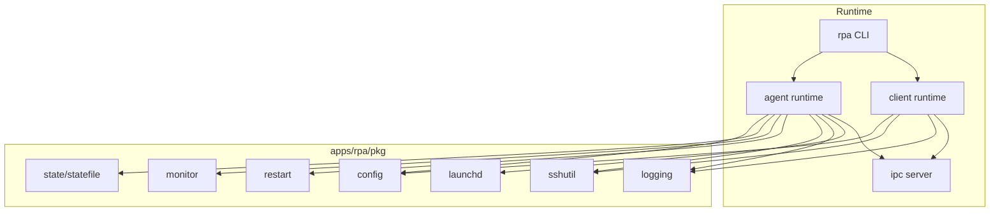
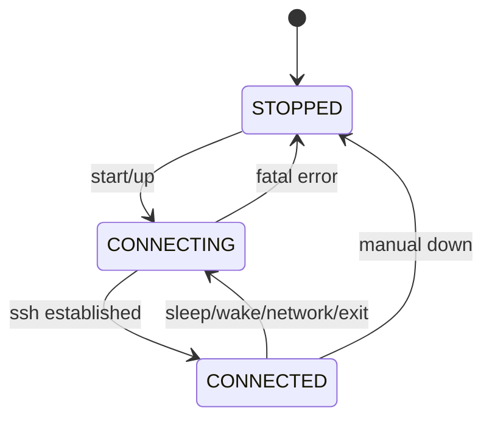

========================================================
프로젝트 개발 세부계획 문서
========================================================

1. 개요 (Overview)

본 프로젝트는 macOS 환경에서 SSH 터널을 안정적으로 유지·복구하기 위한 전용 도구를 개발하는 것을 목표로 한다.
이 도구는 OpenSSH를 그대로 사용하며, SSH의 보안 모델과 신뢰성을 전적으로 존중하는 방향으로 설계된다.
프로젝트의 핵심 문제의식은 “SSH는 충분히 안전하지만, 장시간 터널을 운영하기에는 관리 수단이 부족하다”는 점이다.
따라서 본 프로젝트는 새로운 네트워크 기술이나 보안 체계를 도입하지 않고, SSH 프로세스를 안정적으로 관리하는 역할에만 집중한다.
결과물은 autossh를 대체할 수 있는 macOS 전용 SSH 터널 매니저이다.

추가로 본 프로젝트는 “운영자(Agent 관리자 / Client 관리자) 관점의 UX”를 최우선 가치로 둔다.
사용자는 커맨드 한 줄로 터널을 서비스로 띄우고, 수동으로 종료하기 전까지는 자동 복구를 통해 터널이 계속 유지되는 경험을 제공한다.
또한 CLI 기반의 상태/로그/지표 확인을 기본 제공하여 운영과 문제 진단이 쉽도록 한다.

2. 배경 (Background)

SSH는 수십 년간 검증된 원격 접속 및 터널링 기술이며, 보안성 자체에는 문제가 없다.
그러나 macOS 환경에서 SSH 포트 포워딩을 장시간 유지할 경우, 운영 측면에서 반복적으로 발생하는 문제가 존재한다.

대표적인 문제는 다음과 같다.
첫째, autossh는 launchd와 자연스럽게 통합되지 않아 macOS 서비스 관리 방식과 어긋난다.
둘째, macOS의 sleep / wake, 네트워크 전환(Wi-Fi, VPN) 이벤트를 인식하지 못해 half-dead 상태가 빈번히 발생한다.
셋째, SSH 터널이 왜 끊겼는지, 혹은 왜 동작하지 않는지 파악하기 어렵다.
넷째, SSH 설정, autossh 환경변수, 서비스 설정이 여러 위치에 분산되어 관리 복잡도가 높다.

본 프로젝트는 이러한 문제를 “SSH의 한계”가 아니라 “SSH를 감싸는 운영 계층의 부재”로 정의한다.

3. 설계 전제 및 우려사항 반영 (Design Assumptions & Considerations)

본 프로젝트는 다음과 같은 전제를 명시적으로 받아들인다.

- SSH 자체는 보안적으로 신뢰할 수 있는 기술이다.
- SSH reverse port forwarding은 표준적이지만, 중앙 서버가 단일 신뢰 지점이 된다.
- 중앙 SSH 서버가 침해될 경우, 열려 있는 reverse tunnel은 위험해질 수 있다.
- 이는 본 프로젝트가 새롭게 도입한 위험이 아니라, SSH reverse forwarding 자체의 고유한 특성이다.

따라서 본 프로젝트는 다음을 의도적으로 범위에서 제외한다.
- 중앙 집중식 접근 제어 로직
- 추가 인증 계층
- 세션 단위 권한 관리
- 감사 로그 및 컴플라이언스 기능

추가로 다음 항목은 “단순함 유지”를 위해 기본 범위에서 제외한다.
- SSH 프로토콜/암호화/인증 방식에 대한 확장 또는 우회
- 중앙 서버 측 애플리케이션(에이전트 레지스트리, API, 대시보드)
- 복잡한 멀티테넌시(조직/팀/사용자 권한 모델)

본 프로젝트는 개인 사용자 또는 소규모 환경에서 autossh를 대체하는 도구로 사용하는 것을 전제로 한다.

4. 개발 목표 (Development Goals)

본 프로젝트의 최종 목표는 다음과 같이 정의된다.

“macOS 환경에서 SSH 터널을 half-dead 상태로 방치하지 않고,
시스템 이벤트와 네트워크 변화에 따라 자동으로 복구되는 실행 환경을 제공한다.”

이를 위해 다음의 세부 목표를 설정한다.

- SSH 터널은 언제든지 재시작 가능하다는 전제를 가진다.
- 장시간 유지보다는 빠른 복구를 안정성의 기준으로 삼는다.
- 사용자는 설치 이후 터널의 생명주기를 인지하지 않아도 된다.
- SSH 자체의 보안 모델은 변경하지 않는다.

4.1 핵심 사용자 경험(UX) 목표

본 프로젝트의 “핵심”은 다음 문장으로 요약된다.

- Agent 관리자 / Client 관리자 입장에서 커맨드 한 줄만 입력하면,
  자동 복구되는 터널이 항상 서비스로 떠 있고(launchd),
  사용자가 수동으로 종료하기 전까지는 터널이 유지된다.

이를 만족하기 위한 UX 요구사항은 아래와 같다.

- 원라인 커맨드:
  - 설치/등록/시작이 한 번에 수행된다(최소 1회).
  - 상태 확인/로그 확인/지표 확인도 CLI 커맨드로 가능하다.
- “유지”의 의미:
  - sleep/wake, 네트워크 전환, ssh 프로세스 비정상 종료 등 어떤 이벤트가 발생해도 자동으로 복구 시도를 지속한다.
  - 사용자가 명시적으로 stop/uninstall 하지 않는 한, 서비스는 계속 활성 상태를 유지한다.
- “진단 가능성”:
  - 왜 재시작했는지, 지금 무엇을 하고 있는지(상태/마지막 에러/재시도 대기)를 CLI로 확인할 수 있어야 한다.

5. 개발 컨셉 및 차별점 (Concept & Differentiation)

본 프로젝트의 핵심 컨셉은 “SSH Supervisor”이다.
이 도구는 SSH 클라이언트나 서버를 구현하지 않고, 외부 ssh 바이너리를 관리하는 정책 엔진으로 동작한다.

기존 도구와의 차별점은 다음과 같다.

- autossh와 달리 macOS 시스템 이벤트(sleep, wake, 네트워크 변경)를 1급 이벤트로 취급한다.
- 새로운 프로토콜이나 SaaS 의존성을 추가하지 않는다.
- gossh와 달리 SSH 구현 책임과 보안 패치 책임을 떠안지 않는다.
- 중앙 서버를 복잡하게 만들지 않고, 표준 sshd만을 사용한다.

본 프로젝트의 차별점은 기능의 풍부함이 아니라 운영 안정성에 있다.

6. 기술 스택 (Technology Stack)

본 프로젝트는 다음 기술 스택을 사용한다.

- 구현 언어: Go
  - 이유: 단일 바이너리 배포, 강력한 프로세스 제어, macOS 친화성
- SSH 구현: OpenSSH (외부 바이너리 실행)
- 서비스 관리: macOS launchd (LaunchAgent)
- 설정 형식: 단일 설정 파일 (YAML 또는 TOML)
- 배포 방식: 단일 정적 바이너리 (darwin/amd64, darwin/arm64)

운영/진단을 위한 인터페이스는 다음을 기본으로 한다.
- 제어 plane: 로컬 전용(예: Unix domain socket 또는 localhost) 제어 인터페이스
- 관측성:
  - 로그: 구조화 로그(JSON Lines) + 사람이 읽기 쉬운 텍스트 모드(선택)
  - 지표: CLI로 조회 가능한 카운터/게이지(필수), Prometheus 노출은 옵션

중앙 서버는 별도의 애플리케이션 스택을 요구하지 않는다.

7. 전체 구성 컴포넌트 (System Components)

7.1 Agent (macOS, 서버 호스트 측)

Agent는 SSH reverse port forwarding을 유지하는 장기 실행 프로세스이다.
Agent는 launchd에 의해 실행되며, ssh 프로세스를 직접 자식으로 관리한다.
Agent는 SSH 연결 상태, 시스템 이벤트, 네트워크 이벤트를 감시하고 필요 시 SSH를 재시작한다.

중요: Agent는 “사용자가 stop 하기 전까지 항상 살아있는 서비스”가 되도록 설계한다.
즉, ssh 프로세스가 죽는 것은 정상적인 운영 이벤트로 취급하며, Agent가 정책에 따라 자동 복구한다.

7.2 Client (macOS, 접속자 측)

Client는 SSH local port forwarding을 수행한다.
Client는 중앙 서버에만 인증하며, Agent 호스트에 직접 인증하지 않는다.

Client는 두 가지 사용 방식을 제공한다.
- 단기 실행 모드: 사용자가 필요할 때만 실행해 터널을 열고, 종료되면 상태를 유지하지 않는다.
- 서비스 모드(권장): launchd로 상시 실행되며 자동 복구를 수행하고, 사용자가 수동으로 중지하기 전까지 터널을 유지한다.

7.3 Central Server

Central Server는 표준 OpenSSH 서버이다.
Central Server는 공개키 기반 인증만 수행하며, 애플리케이션 로직을 포함하지 않는다.

7.4 단일 바이너리와 서브커맨드(권장)

배포/운영 단순화를 위해 Agent와 Client는 “하나의 바이너리”로 제공하는 것을 권장한다.
예: `rpa`(가칭) 바이너리에서 `agent`, `client`, `status`, `logs`, `metrics` 서브커맨드를 제공한다.

8. 컴포넌트 간 소통 구조 (Sequence Overview)

- Agent는 중앙 서버로 SSH reverse tunnel을 생성한다.
- 중앙 서버는 해당 포트를 외부에 노출한다.
- Client는 중앙 서버로 SSH local forward를 생성한다.
- Client의 로컬 요청은 중앙 서버를 통해 Agent 호스트의 로컬 포트로 전달된다.

이 구조에서 인증은 오직 중앙 SSH 서버에서만 수행된다.

9. 컴포넌트별 유즈케이스 (Use Cases)

9.1 Agent 유즈케이스

- 시스템 부팅 후 자동으로 실행된다.
- 네트워크가 불안정한 경우 연결을 재시도한다.
- sleep 발생 시 SSH를 종료한다.
- wake 발생 시 SSH를 재시작한다.
- 네트워크 변경 발생 시 SSH를 재시작한다.
- 일정 시간마다 SSH를 주기적으로 재시작한다.

운영자 관점(Agent 관리자) 필수 커맨드 UX(예시):

- `rpa agent up` : 설치(필요 시) + launchd 등록 + 서비스 시작(원라인)
- `rpa agent down` : 서비스 중지(사용자 의도에 의한 종료)
- `rpa status` : 현재 상태(STOPPED/CONNECTING/CONNECTED), 마지막 에러, 재시도 대기, 연결 정보 요약
- `rpa logs --follow` : 로그 스트리밍(진단 목적)
- `rpa metrics` : 지표 출력(카운터/게이지; JSON 또는 표준 포맷)

9.2 Client 유즈케이스

- 사용자가 로컬 포트를 열고 싶을 때 실행한다.
- SSH 연결 실패 시 즉시 실패를 반환한다.
- 단기 실행 모드에서는 터널 종료 시 별도 상태를 유지하지 않는다.
- 서비스 모드에서는 네트워크 전환/프로세스 종료 시 자동 복구한다.

운영자 관점(Client 관리자) 필수 커맨드 UX(예시):

- `rpa client up ...` : 설치(필요 시) + launchd 등록 + 서비스 시작(원라인)
- `rpa client down` : 서비스 중지(사용자 의도에 의한 종료)
- `rpa client open ...` : 필요할 때만 단기 실행으로 local forward 오픈(선택)
- `rpa client doctor` : 연결/키/서버 도달성 사전 점검(선택)

10. 컴포넌트별 세부 구현 단계 (Detailed Implementation Plan)

10.1 Agent 구현

10.1.1 단계 1: 설정 관리

- 배경:
  설정 분산은 운영 복잡도의 주요 원인이므로 반드시 제거해야 한다.
- 세부 구현 목표:
  모든 설정을 단일 파일로 통합한다.
- 도달 기준:
  Agent는 실행 시 단 하나의 설정 파일만 참조한다.
- 진행 상태:
  완료 (YAML 로드/기본값/필수 검증 구현)

10.1.2 단계 2: SSH 실행 및 관리

- 배경:
  SSH 프로세스는 Agent가 완전히 제어할 수 있어야 한다.
- 세부 구현 목표:
  SSH를 외부 프로세스로 실행하고 자식 프로세스로 관리한다.
- 도달 기준:
  SSH 종료 시 Agent가 이를 감지하고 재시작한다.
- 진행 상태:
  완료 (ssh 실행 및 종료 감시, 재시작 루프 구현)

10.1.3 단계 3: 상태 머신 구현

- 배경:
  암묵적인 상태는 half-dead를 유발한다.
- 세부 구현 목표:
  STOPPED, CONNECTING, CONNECTED 상태를 명시적으로 관리한다.
- 도달 기준:
  모든 SSH 재시작 경로가 상태 머신을 통해 이루어진다.
- 진행 상태:
  완료 (상태 전이 구조 구현)

10.1.4 단계 4: 시스템 이벤트 처리

- 배경:
  macOS 환경에서는 sleep/wake가 터널 안정성에 결정적이다.
- 세부 구현 목표:
  sleep 발생 시 SSH를 종료하고 wake 시 재시작한다.
- 도달 기준:
  sleep/wake 이후 half-dead 상태가 발생하지 않는다.
- 진행 상태:
  완료 (IOKit 기반 sleep/wake 감지 후 자동 재시작)

10.1.5 단계 5: 네트워크 이벤트 처리

- 배경:
  네트워크 변경은 TCP 연결을 신뢰할 수 없게 만든다.
- 세부 구현 목표:
  네트워크 변경 시 SSH를 무조건 재시작한다.
- 도달 기준:
  Wi-Fi/VPN 전환 후 터널이 자동 복구된다.
- 진행 상태:
  완료 (SystemConfiguration 기반 네트워크 변화 감지 후 자동 재시작)

10.1.6 단계 6: half-dead 방지 정책

- 배경:
  half-dead는 감지보다 예방이 중요하다.
- 세부 구현 목표:
  SSH 옵션과 주기 재시작 정책을 결합한다.
- 도달 기준:
  장시간 실행 중 터널 무응답 상태가 관찰되지 않는다.
- 진행 상태:
  완료 (기본 SSH 옵션 + 주기 재시작 정책 구현)

10.1.7 단계 7: launchd 통합

- 배경:
  macOS 서비스 관리는 launchd가 표준이다.
- 세부 구현 목표:
  Agent를 LaunchAgent로 등록한다.
- 도달 기준:
  재부팅 후 Agent가 자동 실행된다.
- 진행 상태:
  완료 (plist 생성 및 launchctl bootstrap/bootout 연동)

10.1.8 단계 8: “원라인 up/down” 설치·해제 워크플로우

- 배경:
  운영자는 터널을 “서비스로 올리는 것(up)”과 “명시적으로 내리는 것(down)”만 기억하고 싶다.
- 세부 구현 목표:
  - `agent up`은 (1) 설정 파일 검사, (2) launchd 등록/갱신, (3) 서비스 시작을 한 번에 수행한다.
  - `agent down`은 서비스 중지를 수행하고, 정책적으로 더 이상 자동 복구를 시도하지 않도록 한다.
- 도달 기준:
  신규 환경에서 `agent up` 한 번으로 서비스가 올라가고, `agent down`으로 사용자의 의도대로 내려간다.
- 진행 상태:
  완료 (`agent up/down` 구현)

10.1.9 단계 9: 관측성(로그/지표) 및 상태 조회 CLI

- 배경:
  “항상 떠 있는 서비스”는 문제 발생 시 빠른 원인 파악이 곧 운영 안정성이다.
- 세부 구현 목표:
  - 상태 조회: 상태(STOPPED/CONNECTING/CONNECTED), 마지막 에러, 마지막 연결 시각, 재시도 backoff, 최근 재시작 사유를 조회한다.
  - 로그: 재시작 사유(이벤트 타입, exit code, stderr 요약), 시도 횟수, 설정 요약을 구조화 로그로 남긴다.
  - 지표: 재시작 횟수, 연결 성공/실패 카운트, 현재 backoff, 현재 상태, 마지막 성공 시각 등을 제공한다.
- 도달 기준:
  운영자가 `status`, `logs`, `metrics`만으로 현재 상황을 설명할 수 있다.
- 진행 상태:
  완료 (status/logs/metrics 제공, logs follow 지원, last_success/backoff 등 지표 포함)

10.1.10 단계 10: 복구 정책(폭주 방지) 정교화

- 배경:
  “자동 복구”는 필수지만, 무한 재시도 폭주/배터리 소모/로그 폭증을 방지해야 한다.
- 세부 구현 목표:
  - 지수 backoff + 상한 + 지터(jitter) 적용
  - 특정 오류(인증 실패 등)에서의 행동 정의(예: 즉시 실패로 전환 vs 느린 재시도)
  - 중복 이벤트(sleep/wake/네트워크 변경 연속 발생) 디바운스 처리
- 도달 기준:
  장애 상황에서도 재시작이 합리적인 빈도로 제한되며, 상태/로그에 이유가 남는다.
- 진행 상태:
  완료 (지수 backoff/지터, 오류 분류 기반 중단/대기, 재시작 디바운스 적용)

10.2 Client 구현

10.2.1 단계 1: CLI 인터페이스

- 배경:
  Client는 단순해야 한다.
- 세부 구현 목표:
  최소 인자만으로 local forward를 수행한다.
- 도달 기준:
  한 줄 명령으로 터널이 열린다.
- 진행 상태:
  완료 (init 이후 client run/up로 1~2줄 실행, local forward 지원)

10.2.2 단계 2: SSH 실행

- 배경:
  Client도 SSH 안정성 옵션을 공유해야 한다.
- 세부 구현 목표:
  Agent와 동일한 SSH 옵션 세트를 사용한다.
- 도달 기준:
  Client 터널도 half-dead가 발생하지 않는다.
- 진행 상태:
  완료 (SSH 옵션 공유, keepalive 적용)

10.2.3 단계 3: 서비스 모드(launchd) 제공

- 배경:
  Client 관리자 관점에서도 “수동으로 내리기 전까지 항상 켜져 있는 터널”이 필요할 수 있다.
- 세부 구현 목표:
  - `client up/down` 커맨드를 제공한다.
  - 서비스 모드에서는 네트워크 변경 등 이벤트에서 자동 재시작한다.
- 도달 기준:
  `client up` 이후 사용자가 `client down` 하기 전까지 local forward가 유지된다.
- 진행 상태:
  완료 (client up/down 제공, sleep/network 이벤트 재시작 적용)

10.2.4 단계 4: 진단 친화성(에러 메시지/doctor)

- 배경:
  Client는 실패 시 “무엇을 확인해야 하는지”를 알려주는 것이 운영 효율을 좌우한다.
- 세부 구현 목표:
  - 실패 유형을 분류(키/권한/호스트키/도달성/포트 충돌 등)하고 메시지를 정리한다.
  - 선택적으로 `doctor` 커맨드를 제공해 사전 점검을 수행한다.
- 도달 기준:
  연결 실패 시 사용자가 다음 행동(키 확인, 서버 확인 등)을 결정할 수 있다.
- 진행 상태:
  완료 (실패 분류 및 doctor 커맨드 제공)

11. 성공 기준 (Success Criteria)

성공 기준은 “감(무관찰)”이 아니라 “재현 가능한 시나리오 + 측정 가능한 지표”로 정의한다.

- 유지/복구:
  - sleep → wake 후 자동 복구가 된다.
  - Wi‑Fi ↔ VPN 전환, 네트워크 끊김 후 자동 복구가 된다.
  - ssh 프로세스가 비정상 종료되어도 Agent가 복구한다.
  - Client 서비스 모드에서도 동일한 자동 복구 특성을 가진다.
- 운영 UX:
  - `agent up` 한 번으로 서비스가 등록/시작된다.
  - 사용자가 `agent down` 하기 전까지는 계속 유지된다(자동 복구 시도 포함).
  - `client up` 한 번으로 서비스가 등록/시작된다(선택 기능).
  - 사용자가 `client down` 하기 전까지는 계속 유지된다(자동 복구 시도 포함).
  - `status/logs/metrics`만으로 운영자가 현재 상태를 파악할 수 있다.
- 안정성(정량 예시; 프로젝트 상황에 맞게 수치 확정 필요):
  - 이벤트( sleep/wake, 네트워크 전환 ) 발생 후 N초 이내에 CONNECTED 복귀(p95)
  - 24시간 동안 half-dead 무응답 상태 “관찰 0회”를 테스트/로그로 확인
  - 장애 시 재시도 폭주가 없고(backoff 상한 준수) 로그가 유의미하다

12. 범위 제외 사항 (Out of Scope)

- 멀티 사용자 및 권한 관리
- 중앙 서버 애플리케이션
- 웹 UI
- SSH 프로토콜 확장
- 비-macOS 지원
- 컴플라이언스 목적의 감사/감사추적(규제 대응)

13. 최종 요약

본 프로젝트는 SSH를 대체하지 않고, SSH를 신뢰한 상태에서 운영 안정성을 극대화하는 도구이다.
복잡함을 추가하지 않고, 불확실성을 제거하는 것을 최우선 목표로 한다.
이 문서에 정의된 범위를 유지하는 한, 프로젝트는 단순성과 안정성을 동시에 달성할 수 있다.

14. 내부 코드 구조 다이어그램 (Mermaid)

