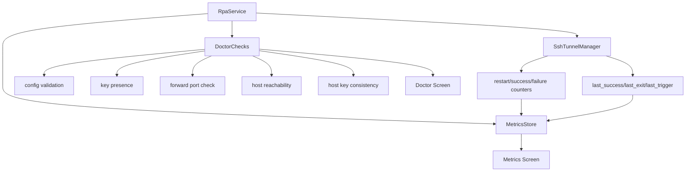

# Android Metrics/Doctor Full Implementation Plan

## Background / Problem
- Metrics/Doctor screens currently use sample data and are not connected to real behavior.
- Users expect diagnostics and metrics parity with `rpa client`.
- Service/SSH state is not fully reflected in UI.

## Goal
- Implement Android Metrics/Doctor at `rpa client` operational depth.
- Connect status/logs/metrics/diagnostics to real data.
- Provide actionable root-cause and remediation guidance.

## Scope
- In scope
  - Metrics: real status/restarts/uptime/last success/backoff fields
  - Doctor: key/config/forward/network/host-key diagnostics
  - Detailed status fields (`last_exit`, `last_trigger`, etc.)
  - Event-based metrics accumulation
- Out of scope
  - Remote forwarding (Agent role)
  - Long-term log retention (Room)

## Current State
- Metrics/Doctor are sample data only.
- Status reflects only part of service state.
- SSHJ connection/forwarding is implemented.

## Direction
- Map `rpa client` metrics/doctor items to Android equivalents.
- Compute metrics/diagnostics in service layer; UI displays only.
- Provide concise, actionable error messages.

## Phased Plan
- Phase 1: metric model and collection
  - Define fields: state/uptime/restarts/backoff/last success
  - Update counters in service/tunnel manager
  - Exit criteria: Metrics screen shows real values
- Phase 2: doctor checks
  - Validate config, key existence, forward port usage, host reachability
  - Show host-key change warnings
  - Exit criteria: Doctor screen shows real check results
- Phase 3: detailed status field integration
  - Wire real values for `last_exit`, `last_trigger`, `last_success`
  - Exit criteria: Status screen details update meaningfully

## Risks and Mitigations
- Risk: network/port checks may fail in mobile environments
  - Mitigation: use timeouts and concise error messages
- Risk: excessive checks can increase battery usage
  - Mitigation: run Doctor manually or at low frequency

## Validation Plan
- Verify Metrics values change with service behavior
- Verify success/failure cases for each Doctor check
- Verify detailed status fields update correctly

## Internal Component Structure (Mermaid)

