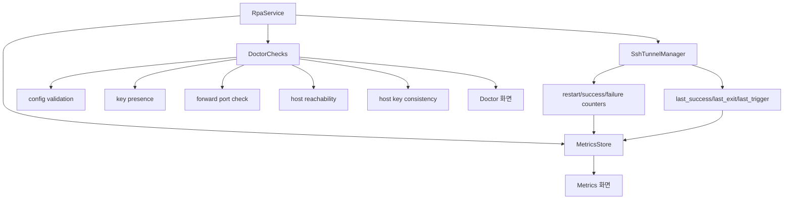

# Android Metrics/Doctor 전면 구현 계획

## 배경/문제
- 현재 Android 앱의 Metrics/Doctor 화면은 샘플 데이터이며 실제 동작과 연결되어 있지 않다.
- 사용자는 rpa client에서 제공하는 수준과 동일한 진단/지표를 기대한다.
- 서비스/SSH 상태 정보가 UI에 충분히 반영되지 않는다.

## 목표
- Android 앱의 Metrics/Doctor를 rpa client와 동일한 수준으로 제공한다.
- 상태/로그/지표/진단을 실제 데이터로 연결한다.
- 사용자에게 문제 원인과 조치 가이드를 제공한다.

## 범위
- 포함 범위
  - Metrics: 상태/재시작/업타임/최근 성공/백오프 등 실데이터 연결
  - Doctor: 키/설정/포워드/네트워크/호스트키 등 진단 항목 구현
  - 상태 상세 필드(last_exit/last_trigger 등) 갱신
  - 로그/이벤트 기반 지표 누적
- 제외 범위
  - 원격 포워드(Agent 역할)
  - 장기 로그 보관(Room)

## 현재 동작 정리
- Metrics/Doctor는 샘플 데이터
- 상태는 서비스 상태 일부만 반영
- SSHJ 연결/포워드는 구현됨

## 개선 방향
- rpa client의 지표/진단 항목을 Android에 맞게 매핑한다.
- 서비스 레이어에서 지표/진단 정보를 계산하고 UI는 이를 표시한다.
- 오류는 사용자 조치가 가능한 메시지로 제공한다.

## 단계별 계획
- Phase 1: 지표 모델 정의 및 수집
  - 상태/업타임/재시작/백오프/최근 성공 등 필드 정의
  - 서비스/터널 매니저에서 카운터 업데이트
  - 완료 기준: Metrics 화면이 실데이터 표시
- Phase 2: 진단(Doctor) 항목 구현
  - 설정 유효성/키 존재/포워드 포트 점유/호스트 접근
  - host key 변경 경고 표기
  - 완료 기준: Doctor 화면에 실제 진단 결과 표시
- Phase 3: 상태 상세 필드 연동
  - last_exit/last_trigger/last_success 등의 실제값 반영
  - 완료 기준: Status 화면 정보가 의미 있게 갱신

## 리스크 및 대응
- 리스크: 모바일 환경에서 네트워크/포트 검사 실패
  - 대응: 타임아웃/간결한 오류 메시지 제공
- 리스크: 과도한 진단으로 배터리 소모
  - 대응: Doctor는 수동 실행 또는 저주기 갱신

## 검증 계획
- Metrics 값이 서비스 동작과 함께 변화하는지 확인
- Doctor 진단 항목별 성공/실패 케이스 확인
- 상태 상세 필드 갱신 확인

## 내부 컴포넌트 구조 (Mermaid)

