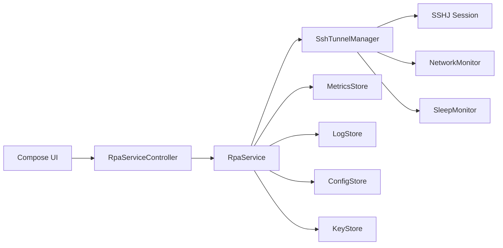
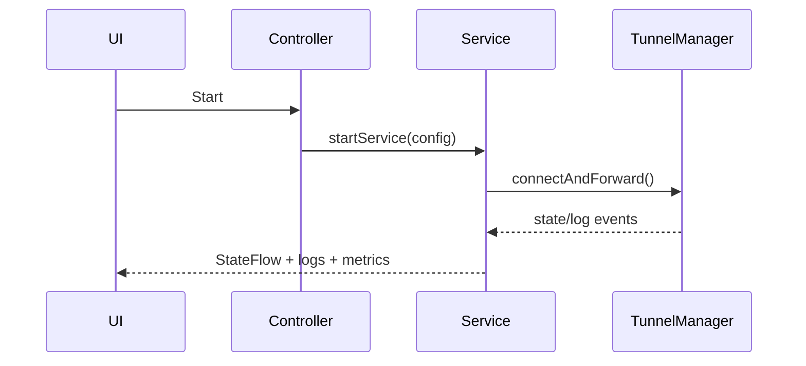

## Android Client Development Plan (Detailed)

This document defines the plan to provide `rpa client` capabilities as an Android app.
It aims to reproduce the macOS client experience of an "always-on tunnel" in a mobile environment,
while accounting for Android background execution constraints and battery policies.

### 1. Goals

- Keep SSH local forwarding stable on Android.
- Automatically recover from network changes and sleep/doze states.
- Provide user-friendly status, logs, and diagnostics.
- Separate always-on service mode from temporary short-lived tunnel mode.

### 2. Background

- macOS can rely on launchd for always-on services, but Android cannot use the same approach due to background restrictions, Doze, and battery optimization.
- Therefore, the architecture should be centered on a **Foreground Service**, and users must accept an always-on notification.

### 3. Scope

In scope:
- SSH local forward (`-L`) support only (default).
- Simple UI (tunnel status, logs, settings).
- Foreground Service based keepalive and recovery.
- Network change detection and automatic restart.

Out of scope:
- Central server application.
- Multi-user/permission management.
- Complex UI/dashboard.
- Remote forwarding (Agent role) for initial release.

### 4. Success Criteria

- "Run once -> keep running" flow with auto recovery after disconnects.
- Users can infer likely root causes from logs/status.
- Reconnection happens within a reasonable time after sleep/doze/network changes.

### 5. Tech Choices

- SSH library:
  - Option A: Apache MINA SSHD
  - Option B: JSch (mature but maintenance concerns)
  - Option C: Go + gomobile (possible `rpa` core sharing)
- Network detection:
  - `ConnectivityManager.NetworkCallback`
- Service runtime:
  - Foreground Service + persistent notification
- State persistence:
  - SharedPreferences or Room

### 6. Architecture Overview

- UI Layer:
  - Settings screen, status screen, log viewer
- Service Layer:
  - ForegroundService owns SSH tunnel lifecycle
  - Includes restart/backoff/diagnostics logic
- Core Layer:
  - SSH session create/terminate
  - stderr/exit classification
  - Log buffering

### 7. Step-by-Step Implementation Plan

#### 7.1 Phase 1: Minimum CLI Replacement (MVP)

- Goal:
  - Provide minimum in-app tunnel execution equivalent to one-line CLI usage
- Detailed targets:
  - Validate SSH connection + local forward behavior
  - Provide settings input (host/user/port/key path/forward spec)
- Exit criteria:
  - A single tunnel can be opened after app launch

#### 7.2 Phase 2: Service Mode (Always-On)

- Goal:
  - Keep tunnel running continuously through Foreground Service
- Detailed targets:
  - Implement persistent notification service
  - Add service start/stop UI
- Exit criteria:
  - Tunnel remains active while app is in background

#### 7.3 Phase 3: Recovery/Restart Policy

- Goal:
  - Auto recovery without restart storms
- Detailed targets:
  - Exponential backoff + jitter
  - Failure classification (auth/host key/network/timeout)
  - Debounce restarts
- Exit criteria:
  - Stable reconnection even on unstable networks

#### 7.4 Phase 4: Diagnostics/Status/Logs

- Goal:
  - Give users enough information for troubleshooting
- Detailed targets:
  - Status: `CONNECTING/CONNECTED/STOPPED`
  - Log viewer (latest N lines)
  - Diagnostic actions (network/key/port conflict checks)
- Exit criteria:
  - Users can self-diagnose likely issues

#### 7.5 Phase 5: Security/Permissions Hardening

- Goal:
  - Keep key handling secure with safe storage
- Detailed targets:
  - Key storage via Android Keystore or SAF (DocumentProvider)
  - Mask sensitive log fields
  - Host key policy option (`accept-new` default)
- Exit criteria:
  - Basic security principles are met in operations

#### 7.6 Phase 6: UX Improvements and Operational Stability

- Goal:
  - Reach long-term usability for daily operation
- Detailed targets:
  - Improve status notifications (connection/restart reason)
  - Add optional boot auto-start
  - Guide users for battery optimization exceptions
- Exit criteria:
  - Stable long-term operational UX

### 8. Risks and Mitigations

- **Doze/battery limits**
  - Keep Foreground Service mandatory
  - Provide battery optimization exclusion guide
- **Frequent network switching**
  - Use NetworkCallback + restart debounce
- **Key management risks**
  - Use Keystore/SAF
  - Avoid plaintext key storage

### 9. Test Plan

- Unit tests:
  - restart/backoff logic
  - failure classification logic
- Integration tests:
  - network on/off
  - Wi‑Fi <-> LTE switching
  - screen lock/unlock and doze entry
- Manual validation:
  - long-run stability (12-24h)
  - battery optimization on/off comparison

### 10. Deliverables

- Android app project
- Documents:
  - configuration guide
  - operations/troubleshooting guide
  - security guide

### 11. Example Timeline (Relative)

- Weeks 1-2: MVP connection success
- Weeks 2-3: Foreground Service + recovery logic
- Weeks 3-4: diagnostics/log/status UI
- Weeks 4-5: security/permission hardening
- Weeks 5-6: UX improvements and stabilization

### 12. Internal Component Structure (Mermaid)

