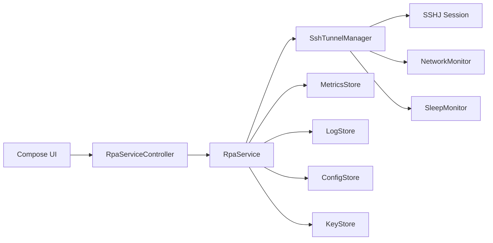
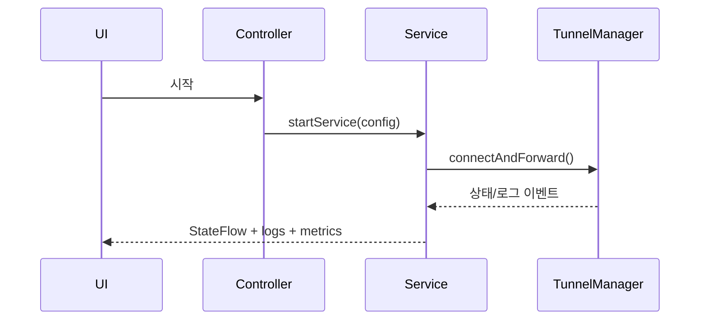

## Android Client 개발 계획 (상세)

본 문서는 rpa client 기능을 Android 앱으로 제공하기 위한 개발 계획서이다.
기존 macOS 기반 rpa client의 “항상 살아있는 터널” 경험을 모바일 환경에서 재현하되,
Android 특유의 백그라운드 제약/배터리 정책을 고려하여 설계한다.

### 1. 목표 (Goals)

- SSH local forward를 Android에서 안정적으로 유지한다.
- 네트워크 전환/절전 상황에서 자동 복구한다.
- 상태/로그/진단 정보를 사용자가 이해하기 쉬운 형태로 제공한다.
- 운영 모드(항상 켜짐)와 임시 실행(단기 터널)을 분리한다.

### 2. 배경 (Background)

- macOS는 launchd 기반 상시 서비스를 제공하지만, Android는
  백그라운드 제한/Doze/배터리 최적화로 인해 동일한 방식이 불가능하다.
- 따라서 **Foreground Service**를 중심으로 설계해야 하며,
  사용자는 “항상 켜짐 알림”을 수용해야 한다.

### 3. 범위 (Scope)

포함:
- SSH local forward (L포워드)만 지원 (기본값).
- 간단한 UI(터널 상태, 로그, 설정).
- Foreground Service 기반 유지/복구.
- 네트워크 변경 감지 및 자동 재시작.

제외:
- 중앙 서버 애플리케이션
- 다중 사용자/권한 관리
- 복잡한 UI/대시보드
- 원격 포워드(Agent 역할) (후속 검토)

### 4. 성공 기준 (Success Criteria)

- “한 번 실행 → 계속 유지” 흐름이 가능하고, 끊김 시 자동 복구됨.
- 사용자가 로그/상태를 보고 문제 원인을 판단할 수 있음.
- sleep/절전/네트워크 전환 후에도 재연결이 합리적인 시간 내 수행됨.

### 5. 기술 선택 (Tech Choices)

- SSH 라이브러리:
  - 후보 A: Apache MINA SSHD
  - 후보 B: JSch (성숙하지만 유지보수 이슈)
  - 후보 C: Go + gomobile (rpa core 공유 가능성)
- 네트워크 감지:
  - Android ConnectivityManager.NetworkCallback
- 서비스 실행:
  - Foreground Service + persistent notification
- 상태 저장:
  - SharedPreferences 또는 Room

### 6. 아키텍처 개요

- UI Layer:
  - 설정 화면, 상태 화면, 로그 뷰어
- Service Layer:
  - ForegroundService가 SSH 터널 생명주기 관리
  - 재시작/백오프/진단 로직 포함
- Core Layer:
  - SSH 세션 생성/종료
  - stderr/exit 분류
  - 로그 버퍼

### 7. 단계별 구현 계획

#### 7.1 단계 1: 최소 실행 CLI 대체 (MVP)

- 목표:
  - “한 줄 실행”에 대응하는 **최소 터널 실행**을 앱에서 제공
- 세부 구현 목표:
  - SSH 연결 + local forward 동작 확인
  - 설정 입력(호스트/유저/포트/키 경로/forward spec)
- 도달 기준:
  - 앱 실행 후 단일 터널이 열린다.

#### 7.2 단계 2: 서비스 모드(상시 유지)

- 목표:
  - Foreground Service로 터널을 지속 유지
- 세부 구현 목표:
  - 알림 고정 서비스 구현
  - 서비스 시작/중지 UI 제공
- 도달 기준:
  - 앱이 백그라운드에 있어도 터널이 유지된다.

#### 7.3 단계 3: 복구/재시작 정책

- 목표:
  - 자동 복구 및 폭주 방지
- 세부 구현 목표:
  - 지수 backoff + jitter 적용
  - 실패 유형 분류(인증/호스트키/네트워크/타임아웃)
  - debounce로 재시작 폭주 방지
- 도달 기준:
  - 불안정한 네트워크에서도 재연결이 안정적으로 수행된다.

#### 7.4 단계 4: 진단/상태/로그 제공

- 목표:
  - 사용자가 문제를 진단할 수 있는 정보 제공
- 세부 구현 목표:
  - 상태: CONNECTING/CONNECTED/STOPPED
  - 로그 뷰어(최근 N줄)
  - 진단 버튼(네트워크/키/포트 충돌 점검)
- 도달 기준:
  - 사용자 스스로 문제 원인을 추정할 수 있다.

#### 7.5 단계 5: 보안/권한 정교화

- 목표:
  - 키/권한 보안 유지 및 안전한 저장
- 세부 구현 목표:
  - 키 저장: Android Keystore 또는 SAF(DocumentProvider)
  - 민감 정보 마스킹 로그
  - 호스트키 검증 정책 제공(accept-new 기본)
- 도달 기준:
  - 기본 보안 원칙을 준수하며 운영 가능하다.

#### 7.6 단계 6: UX 개선 및 운영 안정화

- 목표:
  - 운영 환경에서 지속 사용 가능 수준의 UX 제공
- 세부 구현 목표:
  - 상태 알림 개선(연결/재시작 이유 표시)
  - 자동 시작 옵션(부팅 시 자동 시작)
  - 배터리 최적화 예외 안내
- 도달 기준:
  - 장기 운용 시 사용자 경험이 안정적이다.

### 8. 위험 요소 및 완화 전략

- **Doze/배터리 제한**
  - Foreground Service 유지 필수
  - 사용자에게 배터리 최적화 예외 안내
- **네트워크 전환 빈번**
  - NetworkCallback + 재시작 debounce 도입
- **키 관리**
  - Keystore 및 SAF 활용
  - 로컬 평문 저장 금지

### 9. 테스트 계획

- 단위 테스트:
  - restart/backoff 로직
  - 실패 분류 로직
- 통합 테스트:
  - 네트워크 on/off
  - Wi‑Fi ↔ LTE 전환
  - 화면 잠금/해제, 절전 진입
- 수동 검증:
  - 장시간 유지(12~24h)
  - 배터리 최적화 on/off 비교

### 10. 산출물

- Android 앱 프로젝트
- 문서:
  - 설정 가이드
  - 운영/문제해결 가이드
  - 보안 가이드

### 11. 일정 예시 (상대적)

- 1~2주: MVP 연결 성공
- 2~3주: Foreground Service + 복구 로직
- 3~4주: 진단/로그/상태 UI
- 4~5주: 보안/권한 강화
- 5~6주: UX 개선 및 안정화

### 12. 내부 컴포넌트 구조 (Mermaid)

