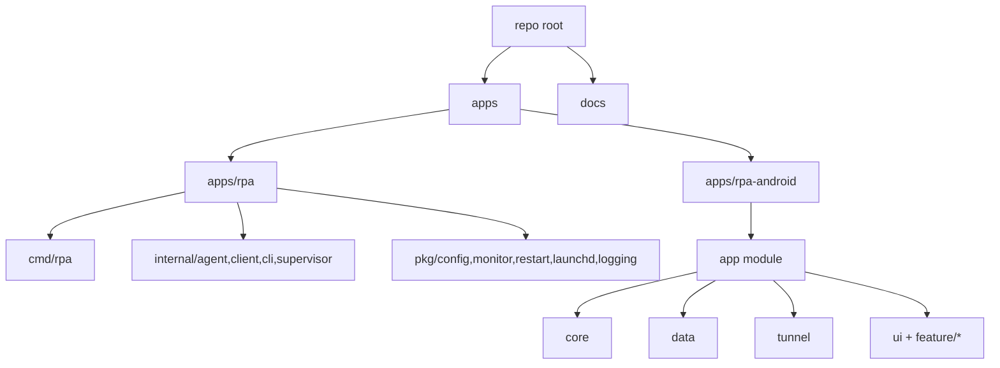

# Directory Structure Plan for Adding a Mobile App

## Background / Problem
- The repository currently follows a typical Go-centric server/agent structure.
- Adding a mobile (Android) app can mix build tools, configs, and dependencies unless boundaries are explicit.
- Planning documents and real code paths need to stay consistent.

## Goal
- Separate mobile app code clearly from existing Go code while keeping coexistence simple.
- Isolate Android (Gradle) and Go module boundaries to avoid interference.
- Keep room for future iOS/cross-platform expansion.

## Scope
- In scope
  - Define where to place Android app directories
  - Reorganize existing structure if needed (minimal changes first)
  - Update docs/README path guidance
- Out of scope
  - Actual Android feature implementation
  - Build/deployment pipeline expansion

## Current State
- Go module root: `cmd/`, `internal/`, `pkg/`
- Documentation: `docs/`, `docs/archive/`
- No Android code yet

## Direction
- Move to a monorepo layout.
- Move the Go module under `apps/rpa`.
- Add Android app under `apps/rpa-android`.
- Keep only top-level guides/common config at root; isolate build tools per app directory.

## Phased Plan
- Phase 1: finalize monorepo migration design
  - Go move targets: `cmd/`, `internal/`, `pkg/`, `go.mod`, `go.sum` -> `apps/rpa/`
  - Android location: `apps/rpa-android/`
  - Exit criteria: paths/scope finalized and documented
- Phase 2: apply structure
  - Move Go code to `apps/rpa/` and adjust module root
  - Add Android project to `apps/rpa-android/`
  - Update root README and related docs with new paths
  - Exit criteria: `go test ./...` works in `apps/rpa/`; Android builds by project dir
- Phase 3: maintenance rules
  - Document module boundaries and common-file placement rules
  - Exit criteria: maintenance rules explicitly documented

## Risks and Mitigations
- Risk: broken import/script paths after Go module root move
  - Mitigation: verify paths based on `go.mod` and update docs
- Risk: Android files mixed at root and confusing tooling
  - Mitigation: keep all Android project files in `apps/rpa-android/`

## Validation Plan
- Confirm `go test ./...` runs in `apps/rpa/`
- Confirm Gradle sync or `gradle tasks` runs in `apps/rpa-android/`
- Verify README/document links

## Internal Component Structure (Mermaid)

