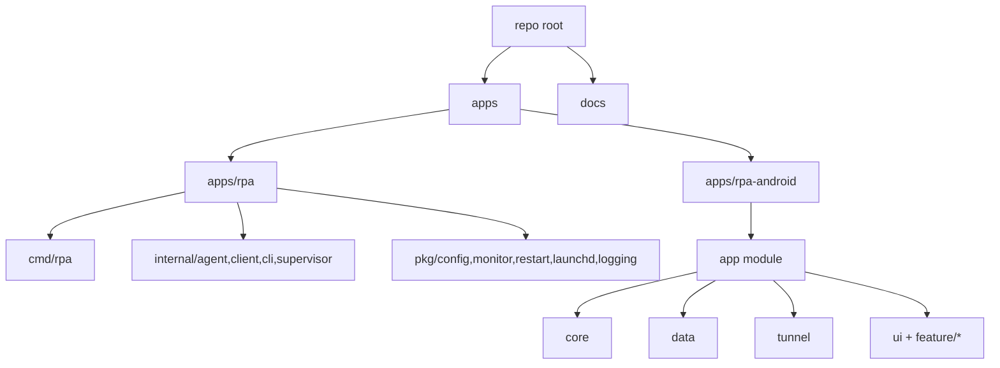

# 모바일 앱 추가를 위한 디렉토리 구조 계획

## 배경/문제
- 현재 저장소는 Go 기반 서버/에이전트 중심의 전형적인 디렉토리 구조다.
- 모바일(Android) 앱을 추가할 경우 빌드 도구, 설정 파일, 의존성이 혼재되어 구조적 충돌과 탐색 비용이 커질 수 있다.
- 계획 문서(안드로이드 클라이언트 구현 계획)와 실제 코드 위치의 일관성이 필요하다.

## 목표
- 모바일 앱 코드를 저장소 내에서 명확히 분리하고, 기존 Go 코드와 충돌 없이 공존하도록 구조를 정리한다.
- Android 프로젝트(Gradle)와 Go 모듈이 서로 간섭하지 않도록 경계를 명확히 한다.
- 추후 iOS/크로스플랫폼 확장도 고려 가능한 구조를 마련한다.

## 범위
- 포함 범위
  - Android 앱 디렉토리 추가 위치 정의
  - 필요 시 기존 구조 재배치(최소화 원칙)
  - 문서/README의 경로 안내 업데이트
- 제외 범위
  - Android 앱 실제 기능 구현
  - 빌드/배포 파이프라인 확장

## 현재 동작 정리
- Go 모듈 루트: `cmd/`, `internal/`, `pkg/` 중심 구조
- 문서: `docs/`, `docs/archive/`에 설계/계획 문서 존재
- Android 관련 코드는 없음

## 개선 방향
- 모노레포 구조로 전환한다.
- Go 모듈은 `apps/rpa` 하위로 이동해 루트와 분리한다.
- Android 앱은 `apps/rpa-android`에 추가한다.
- 루트에는 상위 안내 문서/공통 설정만 남기고, 빌드 도구는 각 앱 폴더에 격리한다.

## 단계별 계획
- Phase 1: 모노레포 전환 설계 확정
  - Go 모듈 이동 대상: `cmd/`, `internal/`, `pkg/`, `go.mod`, `go.sum` → `apps/rpa/`
  - Android 앱 위치: `apps/rpa-android/`
  - 완료 기준: 경로/이동 범위 확정 및 문서 반영
- Phase 2: 구조 적용
  - `apps/rpa/`로 Go 코드 이동 및 모듈 루트 조정
  - `apps/rpa-android/`에 Android 프로젝트 추가
  - 루트 README와 관련 문서에 새로운 경로 안내 추가
  - 완료 기준: `apps/rpa/`에서 `go test ./...` 실행 가능, Android는 디렉토리 단위로 빌드 가능
- Phase 3: 유지보수 기준 정리
  - 모듈 경계 및 공통 파일 위치 규칙 문서화
  - 완료 기준: 문서에 유지보수 규칙 명시

## 리스크 및 대응
- 리스크: Go 모듈 루트 이동으로 import 경로/스크립트 경로가 깨질 수 있음
  - 대응: 이동 후 `go.mod` 기준 경로 점검 및 문서 경로 업데이트
- 리스크: 루트에 Gradle/Android 파일이 섞여 Go 빌드 도구와 혼동
  - 대응: Android 프로젝트는 `apps/rpa-android/`로 격리하고 루트에 Android 파일을 두지 않는다.

## 검증 계획
- `apps/rpa/`에서 `go test ./...` 실행 가능 확인
- `apps/rpa-android/`에서 Gradle sync 또는 `gradle tasks` 실행 가능 확인
- README/문서 링크 경로 검토

## 내부 컴포넌트 구조 (Mermaid)

