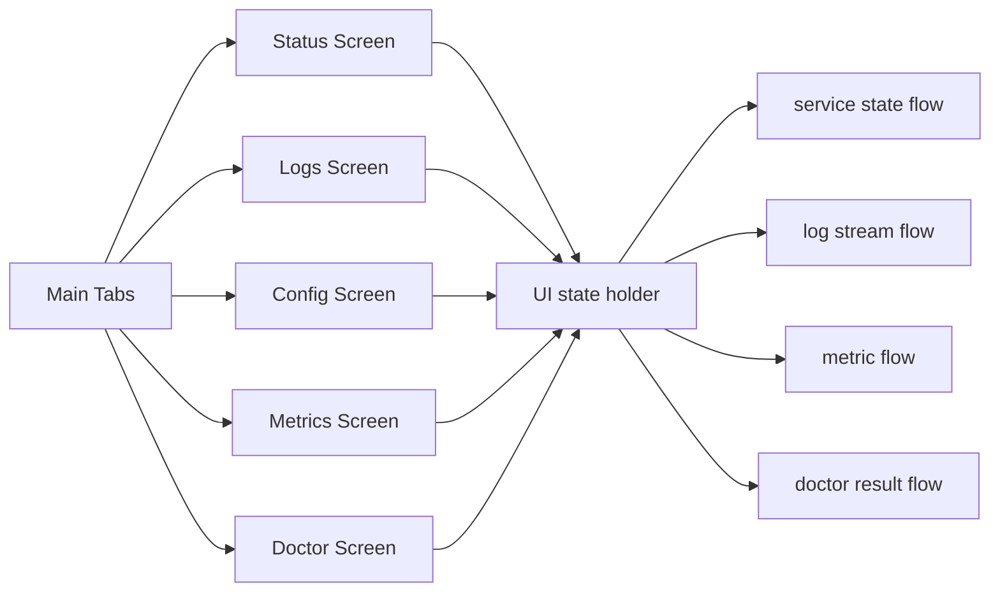

# Android App UI/Feature Composition Plan

## Background / Problem
- The repository is currently centered on Go agent/client code, and Android is a newly added module.
- Core CLI capabilities (`rpa client`, `rpa logs`, `rpa config`) must be offered on mobile.
- UX should remain simple while preserving essential operational control and visibility.

## Goal
- Provide `rpa client`, `rpa logs`, `rpa config`, `rpa metrics`, and `rpa doctor` in Android with minimal screens.
- Build a "simple but complete" structure.
- Design UI that integrates naturally with Foreground Service behavior from plan #2.

## Scope
- In scope
  - Define screen composition and feature mapping
  - Define minimal UI flow (status/start/stop/logs/config/metrics/diagnostics)
  - Define status display and messaging rules
  - Define settings editing UX (text-editor based)
- Out of scope
  - Service/SSH implementation details
  - Design system/branding work
  - Remote-forward (Agent role) management

## Current State
- CLI baseline
  - `rpa client`: run/stop tunnel, check status
  - `rpa logs`: view recent logs
  - `rpa config`: load/save/validate settings
  - `rpa metrics`: inspect key metrics
  - `rpa doctor`: diagnostics/guidance
- Plan #2 already defines Android direction: Foreground Service + status/log/settings.

## Direction
- Keep the number of screens minimal; make key actions possible from one primary screen.
- Keep state labels aligned with CLI conventions (for example `STOPPED/CONNECTING/RUNNING`).
- Use a text-editor model for config rather than many field forms.
- Clearly indicate whether config changes are applied immediately.

## Phased Plan
- Phase 1: finalize screen structure
  - Home (status/start/stop/summary)
  - Logs (recent logs, minimal filters)
  - Config (text editor)
  - Metrics (core metrics)
  - Doctor (diagnostic results/guidance)
  - Exit criteria: feature mapping agreed across 5 screens
- Phase 2: define UI behavior
  - Home: state display, start/stop, last error/restart reason
  - Logs: recent N lines, refresh, simple search
  - Config: YAML editor, save/validate, apply guidance
  - Metrics: key/value list, refresh
  - Doctor: checklist/result summary and guide
  - Exit criteria: required actions/fields specified per screen
- Phase 3: define minimal UX principles
  - Minimize input burden (editor-first, advanced options collapsed)
  - Confirmation dialogs for risky operations (stop/reset)
  - Exit criteria: UX rules documented

## Risks and Mitigations
- Risk: reducing screens too much may drop required operational actions
  - Mitigation: validate with CLI feature mapping checklist
- Risk: config complexity can make UI noisy
  - Mitigation: editor + default template; collapse/expand advanced options

## Validation Plan
- Confirm start/stop/status is reachable within 3 taps from Home
- Confirm recent logs and refresh behavior in Logs screen
- Confirm immediate validation feedback for missing required config fields

## Internal Component Structure (Mermaid)

