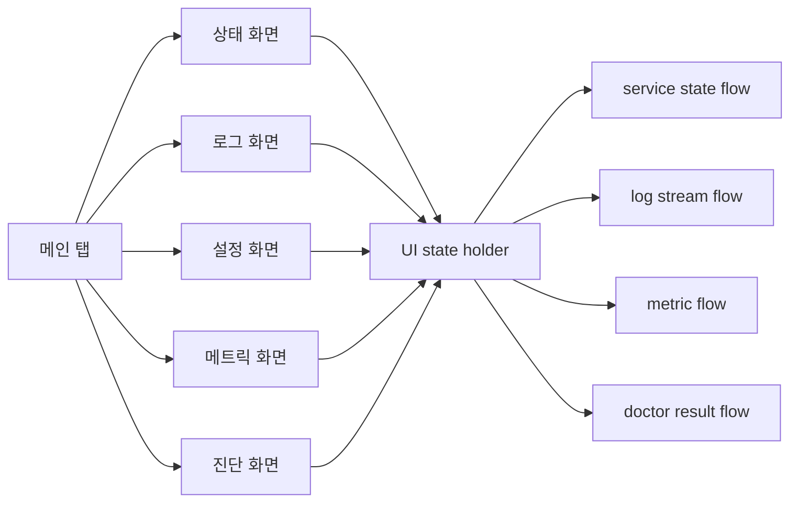

# Android 앱 UI/기능 구성 계획

## 배경/문제
- 현재 저장소는 Go 에이전트/클라이언트 중심 구조이며 Android 앱은 새로 추가되는 모듈이다.
- 기존 CLI 기능 중 `rpa client`, `rpa logs`, `rpa config`에 해당하는 기능을 모바일에서 제공해야 한다.
- UX는 최대한 단순하게 유지하면서도 운영에 필요한 핵심 정보/조작을 제공해야 한다.

## 목표
- Android 앱에서 최소한의 화면 수로 `rpa client`, `rpa logs`, `rpa config`, `rpa metrics`, `rpa doctor` 기능을 제공한다.
- “간단하지만 필요한 것은 모두 있는” 구조를 만든다.
- Foreground Service 기반 동작(계획 문서 2번)과 자연스럽게 연결되는 UI를 설계한다.

## 범위
- 포함 범위
  - UI 화면 구성 및 기능 매핑 정의
  - 최소 UI 플로우(상태/시작/중지/로그/설정/메트릭/진단)
  - 상태 표시 기준 및 메시지 규칙
  - 설정 편집 UX(텍스트 에디터 기반) 정의
- 제외 범위
  - Android 서비스/SSH 구현 상세
  - 디자인 시스템/브랜딩 작업
  - 리모트 포워드(Agent 역할) 관리

## 현재 동작 정리
- CLI 기준 기능
  - `rpa client`: 터널 실행/중지, 상태 확인
  - `rpa logs`: 최근 로그 조회
  - `rpa config`: 설정 로드/저장/검증
  - `rpa metrics`: 주요 지표 조회
  - `rpa doctor`: 진단/가이드 제공
- 기존 계획서(2번)에서 Android는 Foreground Service로 동작하며 상태/로그/설정을 제공하는 구조를 지향함.

## 개선 방향
- 화면 수를 최소화하고, 핵심 동작은 한 화면에서 가능하도록 한다.
- 상태 표기는 CLI와 동일한 표준을 유지한다(예: `STOPPED/CONNECTING/RUNNING`).
- 설정은 개별 get/set 폼 대신 텍스트 에디터 기반으로 제공한다.
- 설정 변경 → 즉시 적용 가능 여부를 UI에서 분명히 안내한다.

## 단계별 계획
- Phase 1: 화면 구조 확정
  - 홈(상태/시작/중지/요약)
  - 로그(최근 로그 리스트, 필터 최소화)
  - 설정(텍스트 에디터 기반)
  - 메트릭(핵심 지표)
  - 진단(doctor 결과/가이드)
  - 완료 기준: 5개 화면으로 기능 매핑 합의
- Phase 2: UI 동작 정의
  - 홈: 상태 표시, 시작/중지 버튼, 마지막 오류/재시작 이유 표시
  - 로그: 최근 N줄 표시, 새로고침, 간단한 검색
  - 설정: YAML 텍스트 에디터, 저장/검증, 적용 안내
  - 메트릭: key/value 리스트, 새로고침
  - 진단: 체크리스트/결과 요약 및 가이드
  - 완료 기준: 각 화면별 필수 행동/표시 항목 명세 완료
- Phase 3: UX 최소 원칙 정리
  - 입력 최소화(텍스트 에디터 기본, 고급 옵션은 접기)
  - 위험 동작(중지/초기화)에는 확인 다이얼로그
  - 완료 기준: UX 규칙 문서화

## 리스크 및 대응
- 리스크: 기능을 줄이다가 운영에 필요한 조작이 누락될 수 있음
  - 대응: CLI 기능 매핑 체크리스트로 누락 여부 점검
- 리스크: 설정이 복잡해져 UI가 지저분해질 수 있음
  - 대응: 텍스트 에디터 + 기본 템플릿 제공, 고급 옵션은 접기/확장으로 분리

## 검증 계획
- 홈에서 시작/중지/상태 확인이 3탭 이내로 가능한지 확인
- 로그 화면에서 최근 로그 확인 및 새로고침 동작 확인
- 설정 화면에서 필수 항목 누락 시 즉시 안내되는지 확인

## 내부 컴포넌트 구조 (Mermaid)

