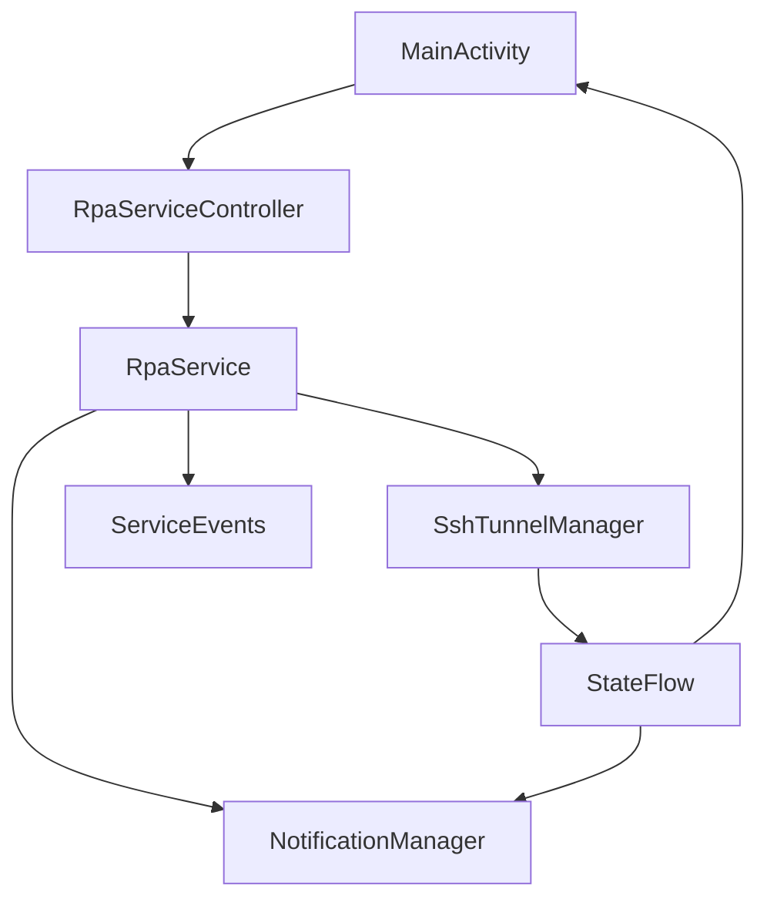
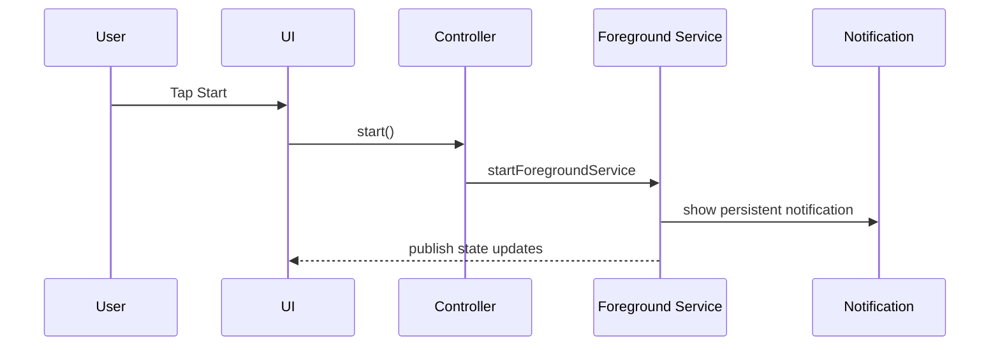

# Android Foreground Service Addition Plan

## Background / Problem
- Foreground Service is required on Android to keep SSH tunnels always on.
- The current app only has UI skeletons, without background execution/notification logic.
- Service, notification, and state wiring are required to avoid shutdown when screen is off.

## Goal
- Make tunnel process run independently of screen state via Foreground Service.
- Display connection status and recent events in status-bar notification.
- Wire UI Start/Stop buttons to service start/stop.

## Scope
- In scope
  - Add Foreground Service base structure
  - Implement notification channel/status-bar notification
  - Connect UI <-> service state (basic status exposure)
- Out of scope
  - Actual SSH tunnel implementation (next phase)
  - Detailed recovery/restart policy implementation (next phase)
  - Real data integration for logs/metrics/doctor

## Current State
- UI uses sample data and Start/Stop are dummy buttons.
- No Foreground Service, notification, or state linkage.

## Direction
- Use Android standard approach (Foreground Service + Notification) for always-on execution.
- Expose the same state in UI and notification.
- In the first step, only reflect service state (`running/stopped/connecting`).

## Phased Plan
- Phase 1: basic Foreground Service
  - Add service class and register it in Manifest
  - Create notification channel
  - Show base notification (status/summary)
  - Exit criteria: persistent notification appears when service starts
- Phase 2: UI-service integration
  - Start/stop service from Start/Stop buttons
  - Reflect service state in UI
  - Exit criteria: UI state matches service state
- Phase 3: richer status messaging
  - Add structure for recent events in notification (for example retry/error)
  - Exit criteria: notification text updates on state changes

## Risks and Mitigations
- Risk: Foreground Service restrictions vary by Android version
  - Mitigation: configure notification channel/permissions clearly
- Risk: service can be stopped by OS policy
  - Mitigation: provide battery optimization exclusion guidance (UI later)

## Validation Plan
- Verify Start/Stop actually starts/stops service
- Verify notification remains persistent and state updates are visible
- Verify service survives with screen off

## Internal Component Structure (Mermaid)

