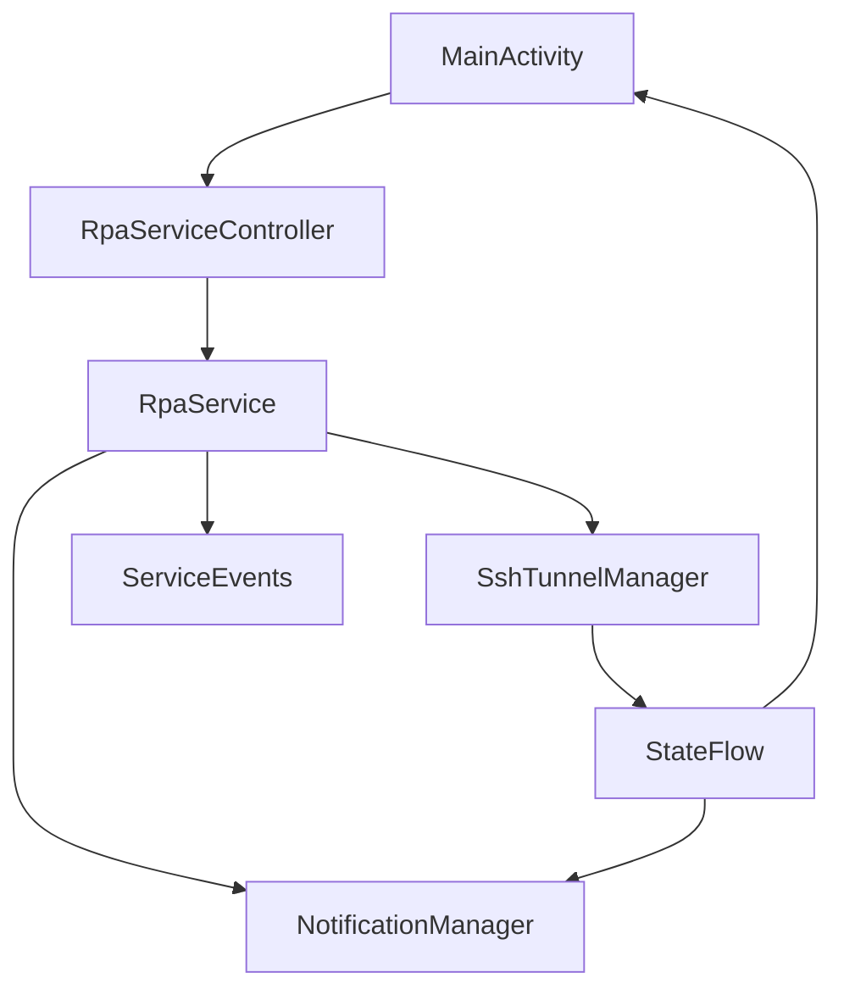
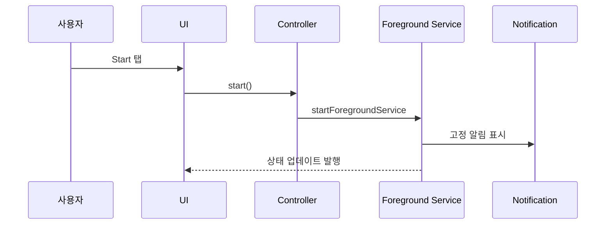

# Android Foreground Service 추가 계획

## 배경/문제
- Android에서 SSH 터널을 “항상 유지”하려면 Foreground Service가 필요하다.
- 현재 앱은 UI 스켈레톤만 있고, 백그라운드 실행/알림 로직이 없다.
- 화면이 꺼지면 종료될 수 있으므로 서비스/알림/상태 연결이 필요하다.

## 목표
- Foreground Service를 통해 터널 프로세스가 화면과 무관하게 동작하도록 한다.
- 상태바 알림에 연결 상태와 최근 이벤트를 표시한다.
- UI의 Start/Stop 버튼이 서비스 시작/중지와 연동되도록 한다.

## 범위
- 포함 범위
  - Foreground Service 기본 구조 추가
  - 알림 채널/상태바 알림 구현
  - UI ↔ 서비스 상태 연동(간단한 상태 노출)
- 제외 범위
  - 실제 SSH 터널 구현(다음 단계)
  - 복구/재시작 정책 상세 구현(다음 단계)
  - 로그/메트릭/닥터의 실제 데이터 연결

## 현재 동작 정리
- UI는 샘플 데이터 기반으로 동작하며 Start/Stop은 더미 버튼이다.
- Foreground Service, 알림, 상태 연동이 없다.

## 개선 방향
- Android 표준 방식(Foreground Service + Notification)으로 항상 실행을 보장한다.
- 상태는 UI와 알림에 동일하게 노출한다.
- 초기 단계에서는 “서비스 상태(실행/중지/연결중)”만 반영한다.

## 단계별 계획
- Phase 1: Foreground Service 기본 구현
  - 서비스 클래스 추가 및 Manifest 등록
  - Notification 채널 생성
  - 기본 알림(상태/요약) 표시
  - 완료 기준: 서비스 시작 시 알림이 고정으로 표시됨
- Phase 2: UI와 서비스 연동
  - Start/Stop 버튼으로 서비스 시작/중지
  - 서비스 상태를 UI에 반영
  - 완료 기준: UI 상태가 서비스 상태와 일치
- Phase 3: 상태 메시지 정교화
  - 알림에 최근 이벤트(예: 재시도/오류)를 노출할 수 있는 구조 추가
  - 완료 기준: 알림 텍스트가 상태 변화에 따라 갱신됨

## 리스크 및 대응
- 리스크: Android 버전별 Foreground Service 제한
  - 대응: 알림 채널/권한 설정을 명확히 구성
- 리스크: 서비스가 OS 정책으로 중단
  - 대응: 배터리 최적화 예외 안내(UI 추가는 후속)

## 검증 계획
- 앱에서 Start/Stop을 눌러 서비스가 시작/중지되는지 확인
- 알림이 고정으로 표시되고 상태가 업데이트되는지 확인
- 화면을 꺼도 서비스가 유지되는지 확인

## 내부 컴포넌트 구조 (Mermaid)

