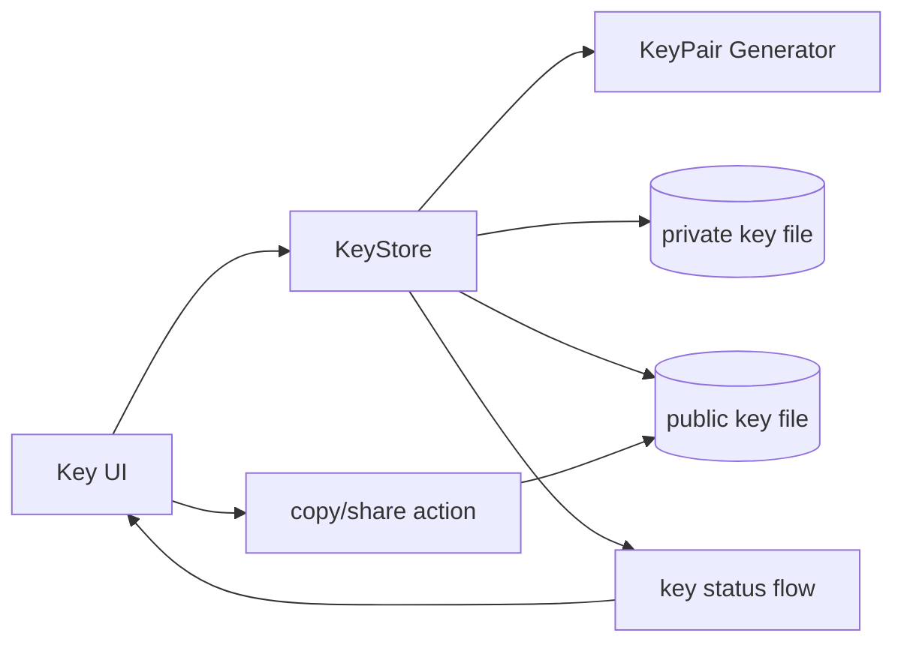

# Android SSH Key Management/UI Plan

## Background / Problem
- SSH key pairs are required to use SSHJ in the Android app.
- The app currently has no UI for SSH key generation/storage/sharing.
- At minimum, operators must be able to deliver a public key to administrators.

## Goal
- Generate and store SSH key pairs in-app.
- Provide easy UI to copy/share the public key.
- Store private keys safely and minimize exposure.

## Scope
- In scope
  - SSH key generation (choose Ed25519 or RSA)
  - Public key display/copy/share UI
  - Key storage location/format definition
- Out of scope
  - Automatic server registration/provisioning
  - Multi-key management (initial version)
  - Advanced security policy (hardware backup, etc.)

## Current State
- No SSH key logic exists in the Android app.
- Key provisioning approach for SSHJ is undecided.

## Direction
- Initial release manages a single key pair only.
- Public key should be instantly copyable/shareable in UI.
- Private key is stored in app internal storage and not directly shown in UI.

## Phased Plan
- Phase 1: key generation/storage
  - Decide key type (default Ed25519)
  - Store generated keys in app-internal storage
  - Exit criteria: generated keys persist after app restart
- Phase 2: public key UI
  - Add public key display screen
  - Add copy button/share intent
  - Exit criteria: public key can be copied/shared
- Phase 3: settings integration
  - Show key state in settings (`exists/missing`)
  - Add regenerate/reset action with confirmation dialog
  - Exit criteria: users can easily inspect key status

## Risks and Mitigations
- Risk: key exposure or unsafe external storage
  - Mitigation: private key is internal-storage only and never directly exposed in UI
- Risk: key generation failures (permission/storage)
  - Mitigation: clear error messages and retry path

## Validation Plan
- Confirm key persists after app restart
- Confirm public key copy/share behavior
- Confirm old key disposal on regeneration

## Internal Component Structure (Mermaid)

