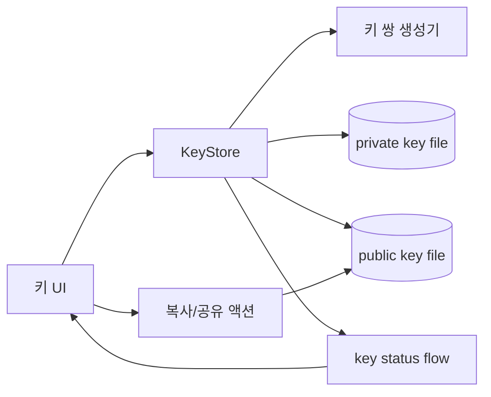

# Android SSH 키 관리/UI 계획

## 배경/문제
- Android 앱에서 SSHJ를 사용하려면 SSH 키 쌍이 필요하다.
- 현재 앱은 SSH 키 생성/보관/공유 UI가 없다.
- 운영상 최소한 공개키(public key)를 관리자에게 전달할 수 있어야 한다.

## 목표
- 앱 내에서 SSH 키 쌍을 생성하고 저장한다.
- 공개키를 손쉽게 복사/공유할 수 있는 UI를 제공한다.
- 개인키는 안전하게 보관하며 외부 노출을 최소화한다.

## 범위
- 포함 범위
  - SSH 키 생성(Ed25519 또는 RSA 선택)
  - 공개키 표시/복사/공유 UI
  - 키 저장 위치/형식 정의
- 제외 범위
  - 서버 자동 등록/프로비저닝
  - 다중 키 관리(초기 버전)
  - 고급 보안 정책(하드웨어 백업 등)

## 현재 동작 정리
- Android 앱에는 SSH 키 관련 로직이 없음.
- SSHJ 사용을 전제로 키 제공 방식이 미정.

## 개선 방향
- 초기 버전은 단일 키 쌍만 관리한다.
- 공개키는 UI에서 즉시 복사/공유할 수 있게 한다.
- 개인키는 앱 내부 저장소에 저장하고 UI로 직접 노출하지 않는다.

## 단계별 계획
- Phase 1: 키 생성/저장
  - 키 타입 결정(기본 Ed25519)
  - 생성된 키를 앱 내부 저장소에 저장
  - 완료 기준: 앱에서 키 생성 후 재실행 시 유지됨
- Phase 2: 공개키 UI
  - 공개키 표시 화면 추가
  - 복사 버튼/공유 인텐트 추가
  - 완료 기준: 공개키를 클립보드/공유 가능
- Phase 3: 설정 연동
  - 설정 화면에서 키 상태(생성됨/없음) 표시
  - 키 재생성/초기화 동작 추가(확인 다이얼로그)
  - 완료 기준: 사용자가 키 상태를 쉽게 파악 가능

## 리스크 및 대응
- 리스크: 키가 노출되거나 외부에 저장될 위험
  - 대응: 개인키는 내부 저장소에만 저장, UI에 노출하지 않음
- 리스크: 키 생성 실패(권한/스토리지)
  - 대응: 오류 메시지 및 재시도 제공

## 검증 계획
- 키 생성 후 앱 재시작 시 키 유지 확인
- 공개키 복사/공유 동작 확인
- 키 재생성 시 기존 키 폐기 확인

## 내부 컴포넌트 구조 (Mermaid)

