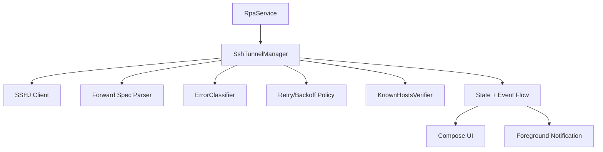
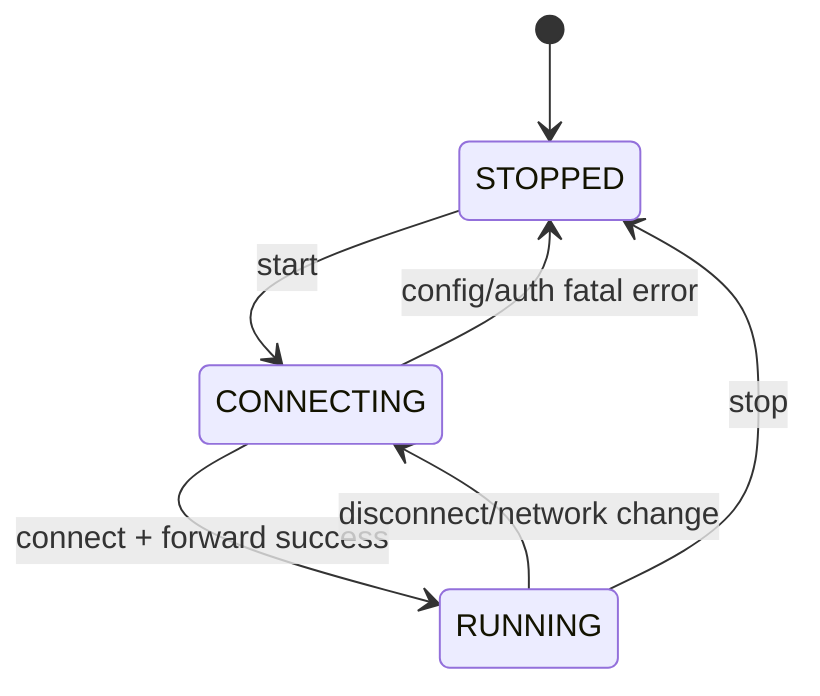

# Android SSH Feature Implementation Plan (SSHJ)

## Background / Problem
- The Android app currently has UI/service stubs but no real SSH tunnel connection.
- Local forwarding (client role) must be implemented using SSHJ.
- Foreground Service and recovery logic must be wired to provide always-on behavior.

## Goal
- Build and maintain SSHJ-based local forwarding reliably on Android.
- Keep tunnel alive in background through Foreground Service integration.
- Expose status/log/metrics/diagnostics in UI (minimal in early phase).

## Scope
- In scope
  - SSHJ connection/auth (key-based)
  - Local port forward settings application
  - Basic reconnect (backoff) and state transition
  - Service notification status updates
- Out of scope
  - Remote forwarding (Agent role)
  - Advanced security policy (key encryption/hardware keystore)
  - Automatic server registration/provisioning

## Current State
- `apps/rpa-android` has UI/Foreground Service/public-key UI.
- SSH connection, forwarding, and recovery logic are not implemented yet.

## Direction
- Service owns SSHJ session lifecycle; UI observes state only.
- Retry with exponential backoff + debounce on failure.
- Keep state terms aligned with CLI (`RUNNING/CONNECTING/STOPPED`).

## Phased Plan
- Phase 1: base SSHJ connection
  - Add SSHJ dependency
  - Create session from host/port/user/key
  - Exit criteria: single-session connection success
- Phase 2: local forwarding
  - Parse `-L` forward spec and create forwarding
  - Exit criteria: local port traffic reaches remote side
- Phase 3: service integration
  - Manage SSH session in Foreground Service
  - Update notification text on state change
  - Exit criteria: session start/stop via Start/Stop
- Phase 4: recovery/retry
  - Implement failure classification/backoff/retry
  - Exit criteria: auto-reconnect on network changes/connection failures

## Risks and Mitigations
- Risk: session drop during Android network transitions
  - Mitigation: trigger reconnect after network event detection
- Risk: auth failures from key format/storage issues
  - Mitigation: validate key formats and provide clear error messages

## Validation Plan
- Local port access test
- Service background persistence test
- Reconnect behavior test after failures

## Internal Component Structure (Mermaid)

