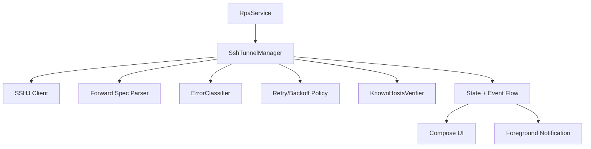
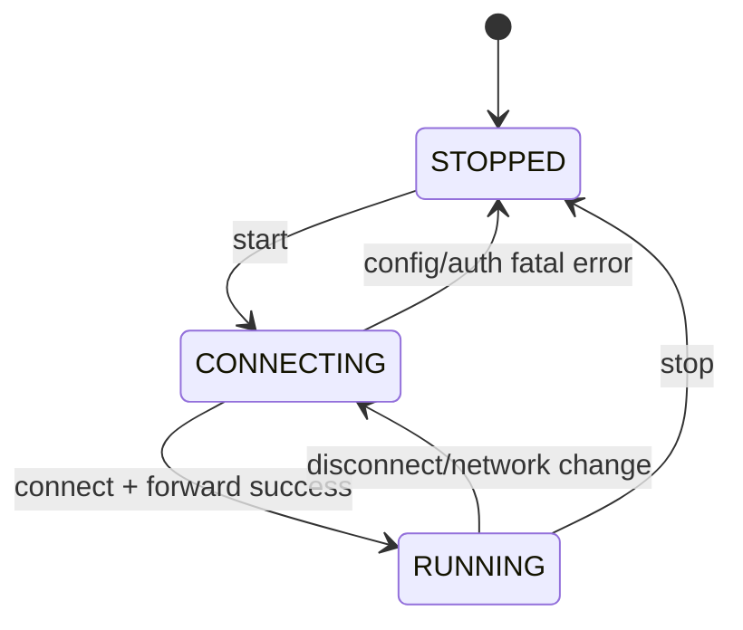

# Android SSH 기능 구현 계획 (SSHJ)

## 배경/문제
- Android 앱은 현재 UI/서비스 스텁만 있고 실제 SSH 터널 연결이 없다.
- SSHJ를 사용해 로컬 포워드(클라이언트 역할)를 구현해야 한다.
- Foreground Service와 복구 로직을 연결해 “항상 유지” 동작을 제공해야 한다.

## 목표
- SSHJ 기반 로컬 포워드를 Android에서 안정적으로 생성/유지한다.
- Foreground Service와 연결되어 백그라운드에서도 터널이 유지된다.
- UI에서 상태/로그/메트릭/진단 정보를 확인할 수 있다(초기 단계는 최소). 

## 범위
- 포함 범위
  - SSHJ 기반 연결/인증(키 기반) 구현
  - Local port forward 설정 적용
  - 기본 재연결(백오프) 및 상태 전환
  - 서비스 알림 상태 업데이트
- 제외 범위
  - 원격 포워드(Agent 역할)
  - 고급 보안 정책(키 암호화, 하드웨어 키스토어)
  - 서버 자동 등록/프로비저닝

## 현재 동작 정리
- `apps/rpa-android`에 UI/Foreground Service/공개키 UI가 존재
- SSH 연결 로직, 포워드, 복구 로직은 미구현

## 개선 방향
- SSHJ 세션 수명주기를 서비스가 소유하고, UI는 상태만 관찰한다.
- 실패 시 지수 백오프 + debounce로 재시도한다.
- 상태 표기는 CLI와 동일한 용어(RUNNING/CONNECTING/STOPPED)를 유지한다.

## 단계별 계획
- Phase 1: SSHJ 연결 기본 구현
  - SSHJ 의존성 추가
  - 호스트/포트/유저/키로 세션 생성
  - 완료 기준: 단일 세션 접속 성공
- Phase 2: 로컬 포워드 구현
  - `-L` 포워드 스펙 파싱 및 포워드 생성
  - 완료 기준: 로컬 포트 접속 시 원격으로 전달됨
- Phase 3: 서비스 연동
  - Foreground Service에서 SSH 세션 관리
  - 상태 변화 → 알림 텍스트 갱신
  - 완료 기준: Start/Stop으로 세션 시작/종료 가능
- Phase 4: 복구/재시도
  - 실패 분류/백오프/재시도 구현
  - 완료 기준: 네트워크 변화/연결 실패 시 자동 재연결

## 리스크 및 대응
- 리스크: Android 네트워크 전환 시 세션 정지
  - 대응: 네트워크 이벤트 감지 후 재연결 트리거
- 리스크: 키 형식/저장 문제로 인증 실패
  - 대응: 공개키/개인키 형식 검증 및 오류 메시지 제공

## 검증 계획
- 로컬 포트 접속 테스트
- 서비스 백그라운드 유지 테스트
- 실패 후 재연결 동작 확인

## 내부 컴포넌트 구조 (Mermaid)

