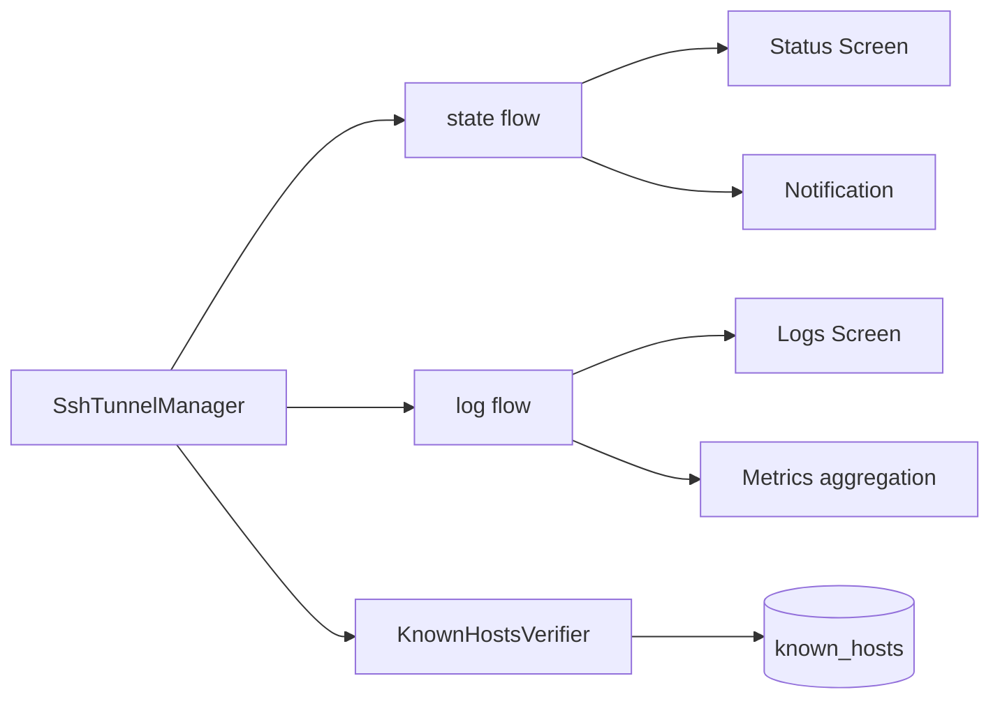

# Android SSH Hardening Plan (Status/Logs/Host Key)

## Background / Problem
- SSHJ tunnels run in service, but status/logs are not reflected live in UI.
- Host key verification currently uses `TrustAll`, which is insecure.
- UX for forward/key errors is insufficient.

## Goal
- Connect service status/logs to UI in real time.
- Implement host key policy (`accept-new`/`known_hosts`).
- Improve error/validation UX for operational reliability.

## Scope
- In scope
  - Expose service status/log streams via Flow and bind UI
  - Implement host key store/verification (`accept-new` default)
  - Improve error messages for forward/key/config failures
- Out of scope
  - Long-term log persistence with Room
  - Advanced security (hardware keystore, key encryption)

## Current State
- SSHJ tunneling/backoff works but UI is fixed to sample data.
- Host key verification is `TrustAll`.

## Direction
- Service emits status/logs via Flow; UI collects and renders them.
- Host keys are managed via `known_hosts` in app internal storage.
- Structure errors so users can identify cause/action immediately.

## Phased Plan
- Phase 1: status/log stream wiring
  - Add `StateFlow`/`SharedFlow` in service
  - Collect in UI for Status/Logs screens
  - Exit criteria: real status/logs shown in UI
- Phase 2: host key policy
  - Save/load `known_hosts`
  - Apply `accept-new` by default
  - Exit criteria: save on first connect, warn on key changes
- Phase 3: error UX improvements
  - Improve messages for config validation and forward parse failures
  - Surface key errors in service notification text
  - Exit criteria: users can identify cause/remediation

## Risks and Mitigations
- Risk: host key handling mistakes causing connection failures
  - Mitigation: `accept-new` on first connect + warning on mismatch
- Risk: increased battery use from frequent UI updates
  - Mitigation: rate-limit log updates (buffering)

## Validation Plan
- Verify UI state changes on connect/disconnect
- Verify Logs screen updates when logs are emitted
- Verify warning display on host key changes

## Internal Component Structure (Mermaid)

