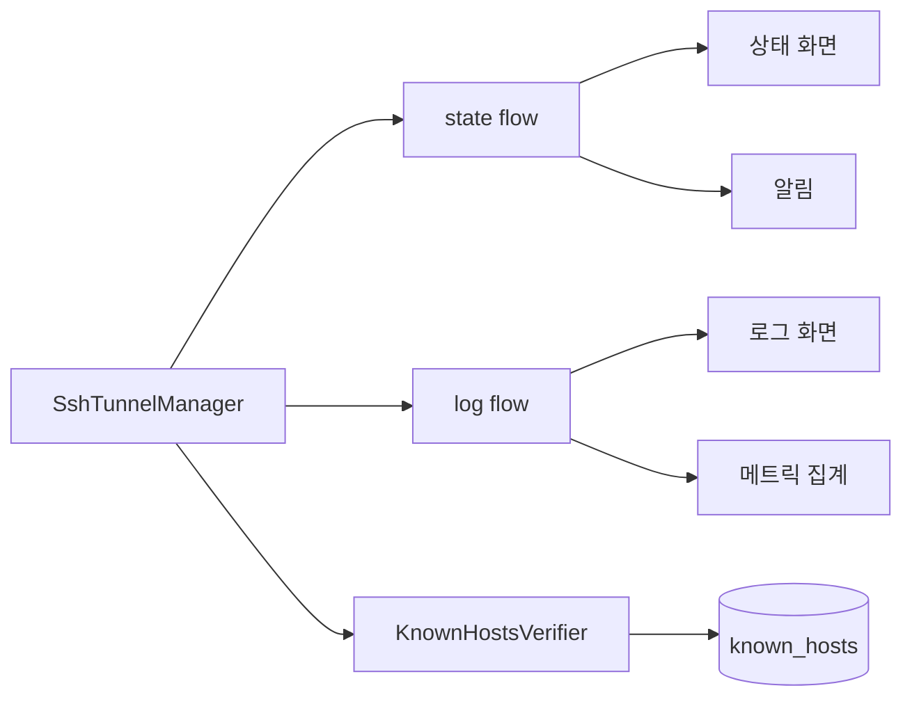

# Android SSH 기능 보강 계획 (상태/로그/호스트키)

## 배경/문제
- 현재 SSHJ 터널은 서비스에서 동작하지만 UI에 상태/로그가 실시간 반영되지 않는다.
- Host key 검증이 TrustAll 상태라 보안상 취약하다.
- 포워드/키 오류에 대한 UX가 부족하다.

## 목표
- 서비스 상태/로그를 UI에 실시간으로 연결한다.
- Host key 정책(accept-new/known_hosts)을 구현한다.
- 오류/검증 UX를 보강해 운영 가능성을 높인다.

## 범위
- 포함 범위
  - 서비스 상태/로그 Flow 노출 및 UI 바인딩
  - Host key 저장/검증(accept-new 기본)
  - 포워드/키/설정 오류 메시지 개선
- 제외 범위
  - 데이터베이스(Room) 기반 장기 로그 저장
  - 고급 보안(하드웨어 키스토어, 키 암호화)

## 현재 동작 정리
- SSHJ 터널/백오프는 동작하지만 UI는 샘플 데이터로 고정됨.
- Host key 검증은 TrustAll로 되어 있음.

## 개선 방향
- 서비스는 상태/로그를 Flow로 내보내고 UI는 이를 수집한다.
- Host key는 앱 내부 저장소에 known_hosts 파일로 관리한다.
- 사용자가 즉시 원인을 파악할 수 있도록 오류 메시지를 구조화한다.

## 단계별 계획
- Phase 1: 상태/로그 스트림 연결
  - Service에 StateFlow/SharedFlow 추가
  - UI에서 collect하여 Status/Logs 화면에 반영
  - 완료 기준: 실제 상태/로그가 UI에 표시됨
- Phase 2: Host key 정책 구현
  - known_hosts 파일 저장/로드
  - accept-new 기본 정책 적용
  - 완료 기준: 최초 연결 시 저장, 이후 변경 시 경고
- Phase 3: 오류 UX 개선
  - 설정 검증 실패/포워드 파싱 실패 메시지 개선
  - 서비스 알림 텍스트에 핵심 오류 표시
  - 완료 기준: 사용자가 원인/조치 파악 가능

## 리스크 및 대응
- 리스크: Host key 관리 실수로 연결 실패
  - 대응: 초기 연결 시 accept-new, 변경 시 안내 메시지
- 리스크: UI 업데이트로 배터리 소모 증가
  - 대응: 로그 업데이트 레이트 제한(버퍼링)

## 검증 계획
- SSH 연결/끊김 시 UI 상태 변경 확인
- 로그 발생 시 Logs 화면 갱신 확인
- Host key 변경 시 경고 표시 확인

## 내부 컴포넌트 구조 (Mermaid)

